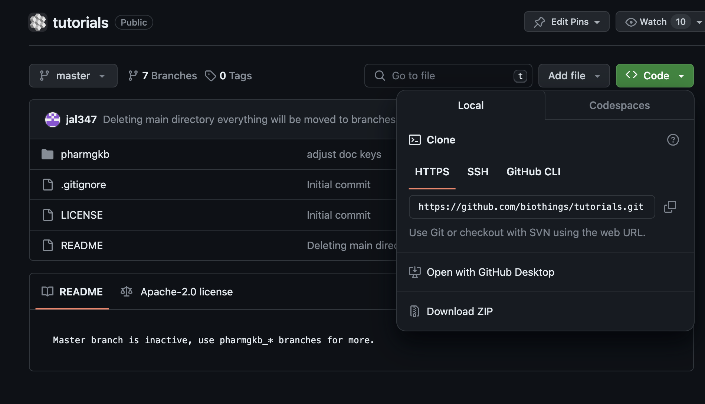
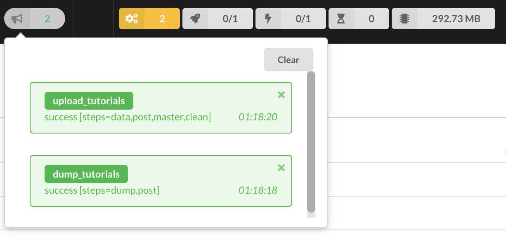
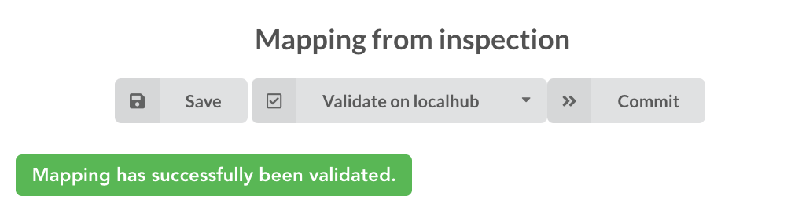
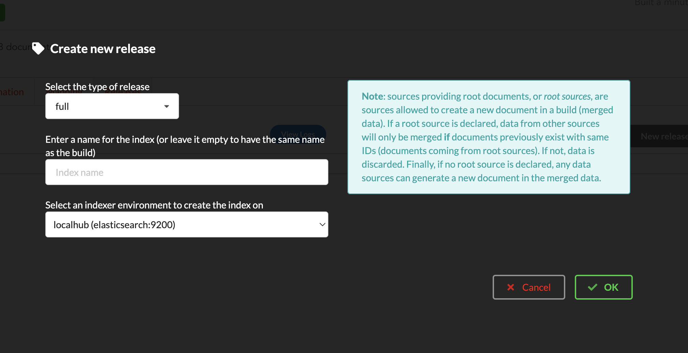

#########################
BioThings Studio tutorial
#########################

This tutorial will guide you through BioThings Studio, a pre-configured system used to build
and administrate BioThings API. This guide will show how to convert a simple flat file
to a fully operational BioThings API, with as minimal effort as possible.

************************
What is BioThings Studio
************************

BioThings Studio is a pre-configured, ready-to-use software. At its core is BioThings Hub, the
backend system behind all BioThings API.

BioThings Hub: the backend sytem
^^^^^^^^^^^^^^^^^^^^^^^^^^^^^^^^

Hub is responsible for maintaining data up-to-date, and
creating data releases for BioThings front-end.

The process of integrating data up to creating to releases involves different steps, as shown
in the following diagram:

.. image:: ../_static/hubarch.png
   :width: 70%

* data is first downloaded locally using `dumpers`
* `parsers` will then convert data into JSON documents, those will be stored in a Mongo database using `uploaders`
* when using multiple sources, data can be combined together using `mergers`
* data releases are then created by either indexing data to an ElasticSearch cluster with `indexers`, or
  by computing the differences between current release and previous one, using `differs`, and applying these
  differences using `syncers`

The final index along with the Tornado application represents the frontend that is actually queried by the
different available clients, and is out of this document's scope.

BioThings Studio
^^^^^^^^^^^^^^^^

The architecture and different softwares involved in this system can be quite intimidating. That's why
the whole system is packaged in a pre-configured software, BioThings Studio. A docker image is available
for `download`_ and contains everything required to run BioThings Hub.

.. _download: http://biothings-containers.s3-website-us-west-2.amazonaws.com/biothings_studio/biothings_studio_latest.docker

.. image:: ../_static/hubstack.png
   :width: 70%

Within the Studio, BioThings Hub and the whole backend system can be accessed through different options:

* a web application allows to interact with the most used elements of the system
* a console, accessible through SSH, gives access to more commands, for advanced usage
* a REST API and a websocket can be used either to interact with the hub, query the differents objects inside,
  and get real-time notifications when processed are running.

Who should use BioThings Studio ?
^^^^^^^^^^^^^^^^^^^^^^^^^^^^^^^^^

BioThings Studio can be used in different scenarios:

* you want to contribute to an existing BioThings API by integrating a new data source
* you want to run you own BioThings API but don't want to have to install all the dependencies and
  learn how to configure all the sub-systems

*************
Prerequisites
*************

Using BioThings Studio requires to have a Docker server up and running, some basic knowledge
about commands to run and use containers. Images have been tested on Docker >=17. Using AWS cloud,
you can use our public AMI **biothings_demo_docker** (``ami-44865e3c``) with Docker pre-configured
and ready for studio deployment. Instance type depends on the size of data you
want to integrate and parsers' performances. For this tutorial, we recommend using instance type with at least
4GiB RAM, such as ``t2.medium``. AMI comes with an extra 30GiB EBS volume, which is more than enough
for the scope of this tutorial.

Alternately, you can install your own Docker server (on recent Ubuntu systems, ``sudo apt-get install docker.io``
is usually enough). You may need to point Docker images directory to a specific hard drive to get enough space,
using ``-g`` option:

.. code:: bash

  # /mnt/docker points to a hard drive with enough disk space
  sudo echo 'DOCKER_OPTS="-g /mnt/docker"' >> /etc/default/docker
  # restart to make this change active
  sudo service docker restart

*****************
What you'll learn
*****************

Through this guide, you'll learn:

* how to obtain a Docker image to run your favorite API
* how to run that image inside a Docker container and how to access BioThings Studio application
* how to integrate a new data source by defining a data plugin
* how to define a build configuration and create data releases
* how to create a simple, fully operational BioThings API serving the integrated data

****************************************
Downloading and running BioThings Studio
****************************************

BioThings Studio is available as a Docker image that you can download following this `link`_ using your favorite web browser or ``wget``:

.. _link: http://biothings-containers.s3-website-us-west-2.amazonaws.com/biothings_studio/biothings_studio_latest.docker

.. code:: bash

  $ wget http://biothings-containers.s3-website-us-west-2.amazonaws.com/biothings_studio/biothings_studio_latest.docker

You must have a running Docker server in order to use that image. Typing ``docker ps`` should return all running containers, or
at least an empty list as in the following example. Depending on the systems and configuration, you may have to add ``sudo``
in front of this command to access Docker server.

.. code:: bash

  $ docker ps
    CONTAINER ID        IMAGE               COMMAND                  CREATED             STATUS              PORTS      NAMES

Once downloaded, the image can be loaded into the server:

.. code:: bash

  $ docker image load < biothings_studio_latest.docker
  $ docker image list
  REPOSITORY          TAG                 IMAGE ID            CREATED             SIZE
  biothings_studio    latest              742a8c502280        2 months ago        1.81 GB

A BioThings Studio instance expose several services on different ports:

* **8080**: BioThings Studio web application port
* **7022**: BioThings hub SSH port
* **7080**: BioThings hub REST API port
* **9200**: ElasticSearch port
* **27017**: MongoDB port
* **8000**: BioThings API, once created, it can be any non-priviledged (>1024) port

We will map and expose those ports to the host server using option ``-p`` so we can access BioThings services without
having to enter the container:

.. code:: bash

  $ docker run --name studio -p 8080:8080 -p 7022:7022 -p 7080:7080 -p 9200:9200 -p 27017:27017 -p 8000:8000 -d biothings_studio

.. note:: Instance will store MongoDB data in `/var/lib/mongodb`, ElasticSearch data in `/var/lib/elasticsearch/` directory,
   and downloaded data and logs in `/home/biothings/biothings_studio/data`. Those locations could require extra disk space,
   if needed Docker option ``-v`` can be used to mount a directory from the host, inside the container.
   Please refer to Docker documentation.

Let's enter the container to check everything is running fine. Services may take a while, up to 1 min, before fully started.
If some services are missing, the troubleshooting section may help.

.. code:: bash

  $ docker exec -ti studio /bin/bash

  root@301e6a6419b9:/tmp# netstat -tnlp
  Active Internet connections (only servers)
  Proto Recv-Q Send-Q Local Address           Foreign Address         State       PID/Program name
  tcp        0      0 0.0.0.0:7080            0.0.0.0:*               LISTEN      -
  tcp        0      0 127.0.0.1:27017         0.0.0.0:*               LISTEN      -
  tcp        0      0 0.0.0.0:7022            0.0.0.0:*               LISTEN      -
  tcp        0      0 0.0.0.0:8080            0.0.0.0:*               LISTEN      120/nginx
  tcp        0      0 0.0.0.0:22              0.0.0.0:*               LISTEN      185/sshd
  tcp6       0      0 :::7080                 :::*                    LISTEN      -
  tcp6       0      0 :::7022                 :::*                    LISTEN      -
  tcp6       0      0 :::9200                 :::*                    LISTEN      -
  tcp6       0      0 :::9300                 :::*                    LISTEN      -
  tcp6       0      0 :::22                   :::*                    LISTEN      185/sshd

We can see the different BioThings services' ports: 7080, 7022 and 8080. We can now access BioThings Studio
using the dedicated web application.

****************************
Overview of BioThings Studio
****************************

BioThings Studio web application can simply be accessed using any browser pointing to port 8080. The home page
shows a summary of current data recent updates. For now, it's pretty quiet since we didn't integrate any data yet.

.. image:: ../_static/homeempty.png

Let's have a quik overview of the different elements accessible through the webapp. At the top, different tabs give
access to the main steps involved in building a BioThings API. We'll get into those in more details while we create our
new API. On the right, we have different information about jobs and resources:

.. figure:: ../_static/commands.png
   :width: 600px

   Running commands are show in this popup, as well as as commands that have been running before, when switching to "Show all"

.. figure:: ../_static/processes.png
   :width: 600px

   When jobs are using parallelization, processes will show information about what is running and how much resources each process takes.
   Notice we only have 1 process available, as we're running a t2.medium instance which only has 2 CPU, the Hub system has automatically
   assigned half of them.

.. figure:: ../_static/threads.png
   :width: 600px

   BioThings Hub also uses threads for parallelization, their activity will be show here.
   Number of queued jobs, waiting for a free process or thread, is showned, as well as the total amount of memory the Hub
   is currenly using

.. figure:: ../_static/notifs.png
   :width: 600px

   In this popup are shown all notifications coming the Hub, in real-time, allowing to follow all jobs and activity.

.. figure:: ../_static/websocket.png
   :width: 600px

   Finally, a logo shows the websocket connection status and quality (green meaning very low latency, red extremely high latency, we're currently running
   on average)

********************************
Creating an API from a flat file
********************************

In this section we'll dive in more details on using BioThings Studio and Hub. We will be integrating a simple flat file as a new datasource
within the Hub, declare a build configuration using that datasource, create a build and data release, and finally instantiate a new API service
and use it to query our data.

Input data, parser and data plugin
^^^^^^^^^^^^^^^^^^^^^^^^^^^^^^^^^^

For this tutorial, we will integrate data from the `Cancer Genome Interpreter`_ (CGI). This datasource is actually used in `MyVariant.info`_, one of the most used
BioThings API. The input file is available here: https://www.cancergenomeinterpreter.org/data/cgi_biomarkers_latest.zip.

.. _`Cancer Genome Interpreter`: https://www.cancergenomeinterpreter.org
.. _`MyVariant.info`: https://myvariant.info

The parser itself is not the main topic of this tutorial, the full code can be found `here`__, in MyVariant's github `repository`__.

.. __: https://github.com/biothings/myvariant.info/blob/master/src/hub/dataload/sources/cgi/cgi_parser.py
.. __: https://github.com/biothings/myvariant.info

From a single flat file, it produces JSON documents looking like this:

.. code:: bash

  {
  "_id": "chr9:g.133747570A>G",
    "cgi": {
      "association": "Resistant",
      "cdna": "c.877A>G",
      "drug": "Imatinib (BCR-ABL inhibitor 1st gen&KIT inhibitor)",
      "evidence_level": "European LeukemiaNet guidelines",
      "gene": "ABL1",
      "primary_tumor_type": "Chronic myeloid leukemia",
      "protein_change": "ABL1:I293V",
      "region": "inside_[cds_in_exon_5]",
      "source": "PMID:21562040",
      "transcript": "ENST00000318560"
    }
  }

.. note:: `_id` key is mandatory and represents a unique ID for this document. Type must a string. _id key is
   used when data from multiple datasource is merged together, that process is done according to its value
   (all documents sharing the same _id from different datasources will be merged together).

We can easily create a new datasource and integrate data using BioThings Studio, by declaring a `data plugin`. Such plugin is defined by:

* a github repository, containing everything useful for the datasource
* within that repository, a `manifest.json` where the parser and the input file are declared

The corresponding data plugin repository can be found at https://github.com/sirloon/mvcgi. The manifest file look like this:

.. code:: bash

  {
      "version": "0.1",
      "dumper" : {
          "data_url" : "https://www.cancergenomeinterpreter.org/data/cgi_biomarkers_latest.zip",
          "uncompress" : true
      },
      "uploader" : {
          "parser" : "parser:load_data",
          "ignore_duplicates" : false
      }
  }

* the `dumper` section declares where the input file is, using `data_url` key. Since the input file is a ZIP file, we first need to uncompress the archive, using `uncompress : true`.
* the `uploader` section tells the Hub how to upload JSON documents to MongoDB. `parser` has a special format, `module_name:function_name`. Here, the parsing function is named
  `load_data` and can be found in `parser.py` module. `ignore_duplicates` tells the Hub no duplicated data should be found (all JSON documents have unique IDs).

Let's register that data plugin using the Studio. First, copy the repository URL:

Moving back to the Studio, click on the |sources| tab, then |menu| icon, this will open a side bar on the left. Click on `New data plugin`, you will be asked to enter the github URL.
Click "OK" to register the data plugin.

.. image:: ../_static/registerdp.png
   :width: 70%

.. |sources| image:: ../_static/sources.png
   :width: 70px

Interpreting the manifest coming with the plugin, BioThings Hub has automatically created for us:

* a `dumper` using HTTP protocol, pointing to the remote file on CGI website. When downloader (or dumping)
  the data source, the dumper will automatically check whether the remote file is more recent than the one
  we may have locally, and decide whether a new version should be downloaded.
* and an `uploader` to which it "attached" the parsing function. This uploader will fetch JSON documents
  from the parser and store those in MongoDB.

Upon registration, the new data source appears

.. image:: ../_static/listdp.png
   :width: 250px

* |dumpicon| is used to trigger the dumper and (if necessary) download remote data
* |uploadicon| will trigger the uploader (note it's automatically triggered if a new version of the data is available)
* |inspecticon| can be used to "inspect" the data, more of that later

.. |dumpicon| image:: ../_static/dumpicon.png
   :width: 25px
.. |uploadicon| image:: ../_static/uploadicon.png
   :width: 25px
.. |inspecticon| image:: ../_static/inspecticon.png
   :width: 25px

Let's open the datasource by clicking on its title to have more information. `Dumper` and `Uploader` tabs are rather empty since
none of these steps have been launched yet. The `Plugin` tab though shows information about the actual source code pulled from the
github repository. As shown, we're currently the HEAD version of the plugin, but if needed, we could freeze the version
by specifiying a git commit hash or a branch/tag name.

.. image:: ../_static/plugintab.png
   :width: 450px

Without further waiting, let's trigger a dump to integrate this new datasource. Either go to `Dump` tab and click on |dumplabelicon|
or click on |sources| to go back to the sources list and click on |dumpicon| at the bottom of the datasource.

.. |dumplabelicon| image:: ../_static/dumplabelicon.png
   :width: 75px

The dumper is triggered, and after few seconds, the uploader is automatically triggered. Commands can be listed by clicking at the top the page. So far
we've run 3 commands to register the plugin, dump the data and upload the JSON documents to MongoDB. All succeeded.

.. image:: ../_static/allcommands.png
   :width: 400px

We also have new notifications as shown by the red number on the right. Let's have a quick look:

Going back to the source's details, we can see the `Dumper` has been populated. We now know the
release number, the data folder, when was the last download, how long it tooks to download the file, etc...

.. image:: ../_static/dumptab.png
   :width: 450px

Same for the `Uploader` tab, we now have 323 documents uploaded to MongoDB.

.. image:: ../_static/uploadtab.png
   :width: 450px

Inspecting the data
^^^^^^^^^^^^^^^^^^^

Now that we have integrated a new datasource, we can move forwared. Ultimately, data will be sent to ElasticSearch, an indexing engine.
In order to do so, we need to tell ElasticSearch how the data is structured and which fields should be indexed (and which should not).
This step consists of creating a "mapping", describing the data in ElasticSearch terminology. This can be a tedious process as we would
need to dig into some tough technical details and manually write this mapping. Fortunately, we can ask BioThings Studio to inspect
the data and suggest a mapping for it.

In order to do so, click on `Mapping` tab, then click on |inspectlabelicon|.

.. |inspectlabelicon| image:: ../_static/inspectlabelicon.png
   :width: 75px

We're asked where the Hub can find the data to inspect. Since we successfully uploaded the data, we now have a Mongo collection so we can
directly use this. Click on "OK" to let the Hub work and generate a mapping for us.

.. image:: ../_static/inspectmenu.png
   :width: 70%

Since the collection is very small, inspection is fast, you should have a mapping generated within few seconds.

.. image:: ../_static/inspected.png
   :width: 400px

For each field highlighted in blue, you can decide whether you want the field to be searchable or not, and whether the field should be searched
by default when no specific field is passed when querying the API. Let's click on "gene" field and make it searched by default.

.. image:: ../_static/genefield.png
   :width: 600px

Indeed, by checking the "Search by default" checkbox, we will be able to search for instance gene "ABL1" with ``/query?q=ABL1``
instead of ``/query?q=cgi.gene:ABL1``.

After this modification, you should see |edited| at the top of the mapping, let's save our changes clicking on |savelabelicon|. Also, before
moving forwared, we want to make sure the mapping is valid, let's click on |validatelabelicon|. You should see this success message:

.. |edited| image:: ../_static/edited.png
   :width: 50px
.. |savelabelicon| image:: ../_static/savelabelicon.png
   :width: 75px

.. note:: "Validate on test" means Hub will send the mapping to ElasticSearch by creating a temporary, empty index. It's immediately
   deleted after validation (wheter successful or not). Also, "test" is the name of an environment, by default, and without further
   manual configuration, this is the only development environment available in the Studio, pointing to embedded ElasticSearch server.

Everything looks fine, one last step is to "commit" the mapping, meaning we're ok to use this mapping as the official, registered mapping,
the one that will actually be used by ElasticSearch. Indeed the left side of the page is about inspected mapping, we can re-launch the
inspection as many time as we want, without impacting active/registered mapping (this is usefull when data structure changes). Click on
|commit| then "OK", and you now should see the final, registered mapping on the right:

.. |commit| image:: ../_static/commit.png
   :width: 75px

.. image:: ../_static/registered.png
   :width: 400px

Defining and creating a build
^^^^^^^^^^^^^^^^^^^^^^^^^^^^^

Once we have integrated data and a valid ElasticSeach mapping, we can move forward by creating a build configuration. A `build configuration`
tells the Hub which datasources should be merged together, and how. Click on |builds| then |menu| and finally, click on |newbuildconf|.

.. |builds| image:: ../_static/builds.png
   :width: 75px
.. |newbuildconf| image:: ../_static/newbuildconf.png
   :width: 125px

.. image:: ../_static/buildconfform.png
   :width: 600px

* enter a `name` for this configuration. We're going to have only one configuration created through this tutorial so it doesn't matter, let's make it "default"
* the `document type` represents the kind of documents stored in the merged collection. It gives its name to the annotate API endpoint (eg. /variant). This source
  is about variant, so "variant" it is...
* open the dropdown list and select the `sources` you want to be part of the merge. We only have one, "mvcgi"
* in `root sources`, we can declare which sources are allowed to create new documents in the merged collection, that is merge documents from a
  datasource, but only if corresponding documents exist in the merged collection. It's usefull if data from a specific source relates to data on
  another source (it only makes sense to merge that relating data if the data itself is present). If root sources are declared, Hub will first
  merged them, then the others. In our case, we can leave it empty (no root sources specified, all sources can create documents in the merged collection)
* the other fields are for advanced usage and are out-of-topic for this tutorial

Click "OK" and open the menu again, you should see the new configuration available in the list.

.. image:: ../_static/buildconflist.png
   :width: 300px

Click on it and create a new build.

.. image:: ../_static/newbuild.png
   :width: 600px

You can give a specific name for that build, or let the Hub generate one for you. Click "OK", after few seconds, you should see the new build displayed on the page.

.. image:: ../_static/builddone.png
   :width: 300px

Open it by clicking on its name. You can explore the tabs for more information about it (sources involved, build times, etc...). The "Release" tab is the one we're going to use next.

Creating a data release
^^^^^^^^^^^^^^^^^^^^^^^

If not there yet, open the new created build and go the "Release" tab. This is the place where we can create new data release. Click on |newrelease|.

.. |newrelease| image:: ../_static/newrelease.png
   :width: 125px

Since we only have one build available, we can't generate an `incremental` release so we'll have to select `full` this time. Click "OK" to launch the process.

.. note:: Should there be a new build available (coming from the same configuration), and should there be data differences, we could generate an
   incremental release. In this case, Hub would compute a diff between previous and new build and generate diff files (using JSON diff format).
   Incremental releases are usually smaller than full releases, but also take more time to deploy (appying diff data). 

Hub will directly index the data on its locally installed ElasticSearch server (``test`` environment). After few seconds, a new `full` release is created.

.. image:: ../_static/newfullrelease.png
   :width: 500px

Generating a BioThings API
^^^^^^^^^^^^^^^^^^^^^^^^^^

At this stage, a new index containing our data has been created on ElasticSearch, it is now time for final step...
Click on |api| then |menu| and finally |newapi|:

.. |api| image:: ../_static/api.png
   :width: 75px
.. |newapi| image:: ../_static/newapi.png
   :width: 125px

***************
Troubleshooting
***************

We test and make sure, as much as we can, that standalone images are up-to-date and hub is properly running for each
data release. But things can still go wrong...

First make sure all services are running. Enter the container and type ``netstat -tnlp``, you should see
services running on ports (see usual running `services`_). If services running on ports 7080 or 7022 aren't running,
it means the hub has not started. If you just started the instance, wait a little more as services may take a while before
they're fully started and ready.

If after ~1 min, you still don't see the hub running, log to user ``biothings`` and check the starting sequence.

.. note:: Hub is running in a tmux session, under user ``biothings``

.. code:: bash

  # sudo su - biothings
  $ tmux a # recall tmux session

  python -m biothings.bin.autohub
  (pyenv) biothings@a6a6812e2969:~/mygene.info/src$ python -m biothings.bin.autohub
  INFO:root:Hub DB backend: {'module': 'biothings.utils.es', 'host': 'localhost:9200'}
  INFO:root:Hub database: hubdb
  DEBUG:asyncio:Using selector: EpollSelector
  start

You should see something looking like this above. If not, you should see the actual error, and depending on the error, you may be able to
fix it (not enough disk space, etc...). The hub can be started again using ``python -m biothings.bin.autohub`` from within the application
directory (in our case, ``/home/biothings/mygene.info/src/``)

.. note:: Press Control-B then D to dettach the tmux session and let the hub running in background.

Logs are available in ``/data/mygene.info/logs/``. You can have a look at:

* ``dump_*.log`` files for logs about data download
* ``upload_*.log`` files for logs about index update in general (full/incremental)
* ``sync_*.log`` files for logs about incremental update only
* and ``hub_*.log`` files for general logs about the hub process

Finally, you can report issues and request for help, by joining Biothings Google Groups (https://groups.google.com/forum/#!forum/biothings)

