*****************
Developer's guide
*****************

This section provides both an overview and detailed information abouth **BioThings Studio**,
and is specifically aimed to developers who like to know more about internals.

A complementary `tutorial <studio_tutorial.html>`_ is also available, explaining how to setup and use **BioThings Studio**,
step-by-step, by building an API from a flat file.

========================
What is BioThings Studio
========================

**BioThings Studio** is a pre-configured, ready-to-use application. At its core is **BioThings Hub**, the
backend service behind all BioThings APIs.

BioThings Hub: the backend service
^^^^^^^^^^^^^^^^^^^^^^^^^^^^^^^^^^

**Hub** is responsible for maintaining data up-to-date, and
creating data releases for the BioThings frontend.

The process of integrating data and creating releases involves different steps, as shown
in the following diagram:

.. image:: ../_static/hubarch.png
   :width: 100%

* data is first downloaded locally using `dumpers`
* `parsers` will then convert data into JSON documents, those will be stored in a Mongo database using `uploaders`
* when using multiple sources, data can be combined together using `mergers`
* data releases are then created by either indexing data to an ElasticSearch cluster with `indexers`, or
  by computing the differences between the current release and previous one, using `differs`, and applying these
  differences using `syncers`

The final index along with the Tornado application represents the frontend that is actually queried by the
different available clients, and is out of this document's scope.

BioThings Studio
^^^^^^^^^^^^^^^^

The architecture and different software involved in this system can be quite intimidating. To help
the whole service is packaged as a pre-configured application, **BioThings Studio**. A docker image is available
Docker Hub registry, and be pulled using:

.. code:: bash

   $ docker pull biothings/biothings-studio:0.2a

.. image:: ../_static/hubstack.png
   :width: 100%

A **BioThings Studio** instance expose several services on different ports:

* **8080**: **BioThings Studio** web application port
* **7022**: **BioThings Hub** SSH port
* **7080**: **BioThings Hub** REST API port
* **9200**: ElasticSearch port
* **27017**: MongoDB port
* **8000**: BioThings API, once created, it can be any non-priviledged (>1024) port
* **9000**: Cerebro, a webapp used to easily interact with ElasticSearch clusters

**BioThings Hub** and the whole backend service can be accessed through different options according to some
of these services

* a web application allows interaction with the most used elements of the service (port 8080)
* a console, accessible through SSH, gives access to more commands, for advanced usage (port 7022)
* a REST API and a websocket (port 7080) can be used to interact with the **Hub**, query the differents objects inside,
  and get real-time notifications when processes are running. This interface is a good choice for third-party integration.

Who should use BioThings Studio ?
^^^^^^^^^^^^^^^^^^^^^^^^^^^^^^^^^

**BioThings Studio** can be used in different scenarios:

* you want to contribute to an existing BioThings API by integrating a new data source
* you want to run your own BioThings API but don't want to have to install all the dependencies and
  learn how to configure all the sub-systems

Filesystem overview
^^^^^^^^^^^^^^^^^^^

Several locations on the filesystem are important to notice, when it comes to change default configuration or troubleshoot the application.

* **Hub** (backend service) is running under ``biothings`` user, running code is located in ``/home/biothings/biothings_studio``. It heavely relies on
  BioThings SDK located in ``/home/biothings/biothings.api``.
* Several scripts/helpers can be found in ``/home/biothings/bin``:

  - ``run_studio`` is used to run the Hub in a tmux session. If a session is already running, it will first kill it and create new one. We don't have
    to run this manually when the studio first starts, it is part of the starting sequence.
  - ``update_studio`` is used to fetch the latest code for **BioThings Studio**
  - ``update_biotnings``, same as above but for BioThings SDK

* ``/data`` contains several important folders:

  - ``mongodb`` folder, where MongoDB server stores its data
  - ``elasticsearch`` folder, where ElasticSearch stores its data
  - ``biothings_studio`` folder, containing different sub-folders used by the **Hub**

    - ``datasources`` contains data downloaded by the different ``dumpers``, it contains sub-folders named according to the datasource's name.
      Inside the datasource folder can be found the different releases, one per folder.
    - ``dataupload`` is where data is stored when uploading data to the Hub (see below dedicated section for more).
    - ``logs`` contains all log files produced by the **Hub**
    - ``plugins`` is where data plugins can be found (one sub-folder per plugin's name)

.. note:: Instance will store MongoDB data in `/data/mongodb`, ElasticSearch data in `/data/elasticsearch/` directory,
   and downloaded data and logs in `/data/biothings_studio`. Those locations could require extra disk space,
   if needed Docker option ``-v`` can be used to mount a directory from the host, inside the container.
   Please refer to Docker documentation. It's also important to give enough permissions so the differences services
   (MongoDB, ElasticSearch, NGNIX, BioThings Hub, ...) can actually write data on the docker host.

Configuration files
^^^^^^^^^^^^^^^^^^^

**BioThings Hub** expects some configuration variables to be defined first, in order to properly work. In most **BioThings Studio**, a ``config_hub.py`` defines
those parameters, either by providing default value(s), or by setting it as ``ConfigurationError`` exception. In that latter case, it means no defaults can be used
and user/developer has to define it. A final ``config.py`` file must be defined, it usually imports all parameters from ``config_hub.py`` (``from config_hub import *``).
That ``config.py`` *has* to be defined before the **Hub** can run.

.. note:: This process is only required when implementing or initializing a Hub from scratch. All **BioThings Studio** applications comes with that file defined, the **Hub**
   is ready to be used.

It's also possible to override parameters directly from the webapp/UI. In that case, new parameters' values are stored in the internal Hub database. Upon start, **Hub** will check
that database and supersed any values that are defined directly in the python configuration files. This process is handled by class ``biothings.ConfigurationManager``.

Finally, a special (simple) dialect can be used while defining configuration parameters, using special markup within comments above declaration. This allows to:
* provide documentation for parameters
* put parameters under different categories
* mark a parameter as read-only
* set a parameter as "invisible" (not exposed)

This process is used to expose **Hub** configuration through the UI, automatically providing documentation in the webapp without having to duplicate code, parameters and documentation.
For more information, see class ``biothings.ConfigurationParser``, as well as existing configuration files in the different studios.

Services check
^^^^^^^^^^^^^^

Let's enter the container to check everything is running fine. Services may take a while, up to 1 min, before fully started.
If some services are missing, the troubleshooting section may help.

.. _services:

.. code:: bash

  $ docker exec -ti studio /bin/bash

  root@301e6a6419b9:/tmp# netstat -tnlp
  Active Internet connections (only servers)
  Proto Recv-Q Send-Q Local Address           Foreign Address         State       PID/Program name
  tcp        0      0 0.0.0.0:7080            0.0.0.0:*               LISTEN      -
  tcp        0      0 0.0.0.0:9000            0.0.0.0:*               LISTEN      -
  tcp        0      0 127.0.0.1:27017         0.0.0.0:*               LISTEN      -
  tcp        0      0 0.0.0.0:7022            0.0.0.0:*               LISTEN      -
  tcp        0      0 0.0.0.0:9200            0.0.0.0:*               LISTEN      -
  tcp        0      0 0.0.0.0:8080            0.0.0.0:*               LISTEN      166/nginx: master p
  tcp        0      0 0.0.0.0:9300            0.0.0.0:*               LISTEN      -
  tcp        0      0 0.0.0.0:22              0.0.0.0:*               LISTEN      416/sshd
  tcp6       0      0 :::7080                 :::*                    LISTEN      -
  tcp6       0      0 :::7022                 :::*                    LISTEN      -
  tcp6       0      0 :::22                   :::*                    LISTEN      416/sshd

Specifically, BioThings Studio services' ports are: 7080, 7022 and 8080.

============================================
Overview of BioThings Studio web application
============================================

**BioThings Studio** web application can simply be accessed using any browser pointing to port 8080. The home page
shows a summary of current data recent updates. For now, it's pretty quiet since we didn't integrate any data yet.

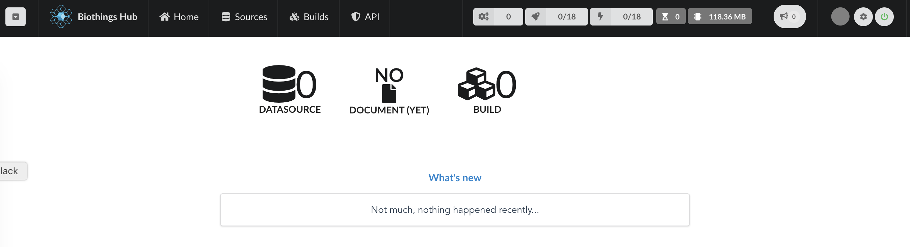

Let's have a quick overview of the different elements accessible through the webapp. On the top left is the connection widget.
By default, **BioThings Studio** webapp will connect to the hub API through port 7080, the one running with docker. But the webapp
is a static web page so you can access any other Hub API by configuring a new connection:

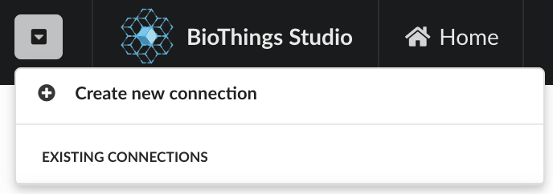

Enter the Hub API URL, ``http://<host>:<port>`` (you can omit ``http://``, the webapp will use that scheme by default)

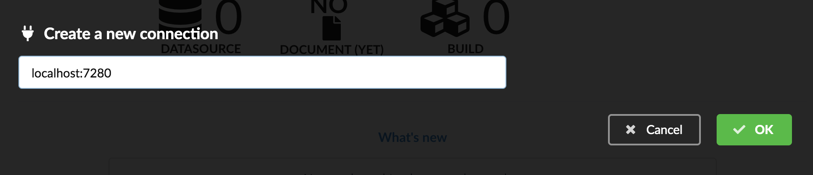

The new connection is now listed and can be accessed quickly later simply by selecting it. Note the connection can be deleted with the "trash" icon,
but cannot be edited.

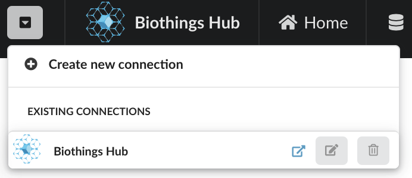

Following are several tabs giving access to the main steps involved in building a BioThings API.
We'll get into those in more details while we create our
new API. On the right, we have different information about jobs and resources:

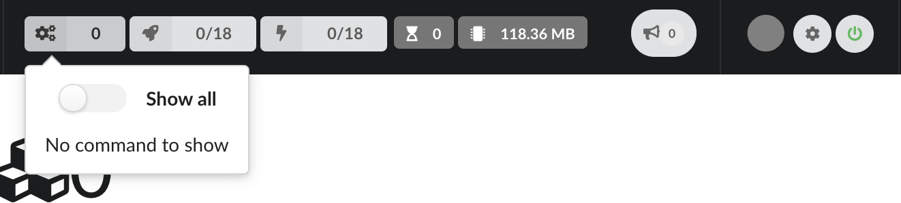

   Running commands are show in this popup, as well as as commands that have been running before, when switching to "Show all"

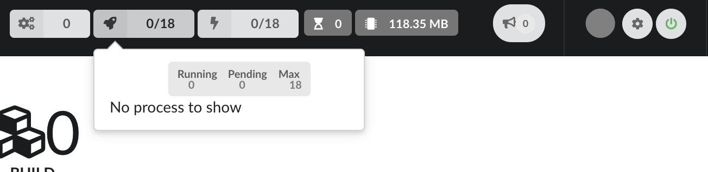

   When jobs are using parallelization, processes will show information about what is running and how much resources each process takes.
   Notice we only have 1 process available, as we're running a t2.medium instance which only has 2 CPU, **Hub** has automatically
   assigned half of them.

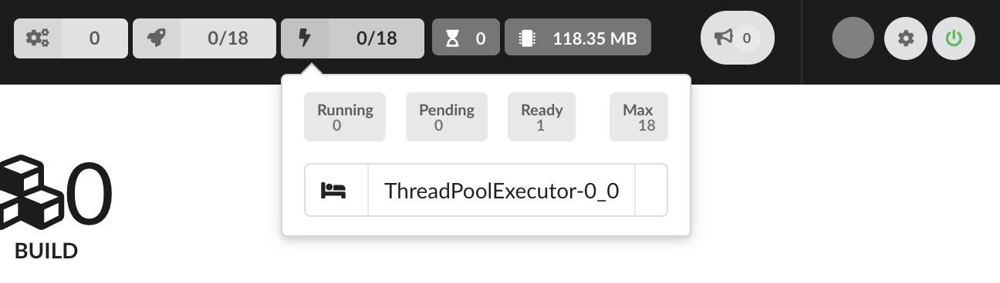

   **BioThings Hub** also uses threads for parallelization, their activity will be show here.
   Number of queued jobs, waiting for a free process or thread, is showned, as well as the total amount of memory the **Hub**
   is currenly using

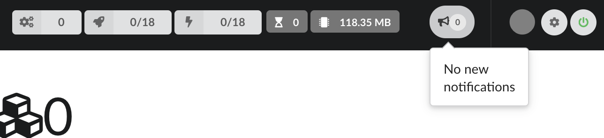

   In this popup are shown all notifications coming from the **Hub**, in real-time, allowing to follow all jobs and activity.

.. figure:: ../_static/loader.png
   :width: 600px

   A first circle shows the page loading activity. Gray means nothing active, flashing blue means webapp is loading information from the Hub, and red means an
   error occured (error should be found in either notifications or by openin the logs from the bottom right corner).

   The next button with a cog icon gives access to the configuration and is described in the next section.

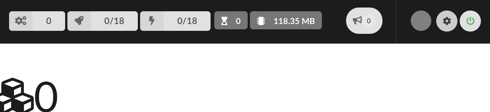

   Finally, a logo shows the websocket connection status (green power button means "connected", red plug means "not connected")
   on average)

=============
Configuration
=============

By clicking on the cog icon in the bar on the right, **Hub** configuration can be accessed. The configuration parameters, documentation, sections are defined in python configuration files
(see `Configuration files`). Specifically, if a parameter is hidden, redacted or/and read-only, it's because of how it was defined in the python configuration files.

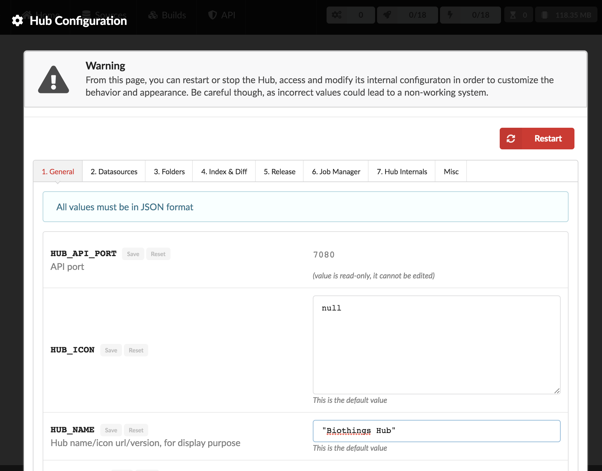

Any parameter must be entered in a JSON format. Ex: double quotes for strings, square brackets to define lists, etc... Once a parameter has been changed, change can be saved using
the "Save" button, available for each parameters. The "Reset" button can be used to switch back the original, default value that was defined in the configuration files.

Ex: Update Hub's name

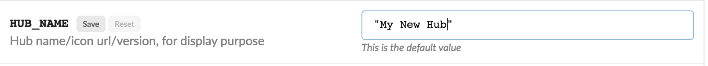

First enter the new name, for paramerer ``HUB_NAME``. Because the value has changed, the "Save" button is available.

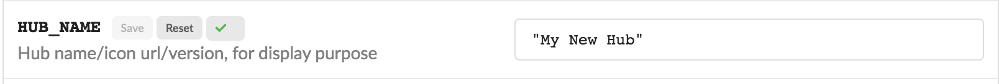

Upon validation, a green check mark is shown, and because the value is not the default one, the "Reset" button is now available. Clicking on it will switch back the
value for that parameter to the original, default one.

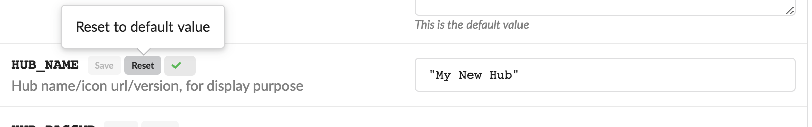

Note each time a parameter is changed, **Hub** needs to be restarted, as shown on the top.

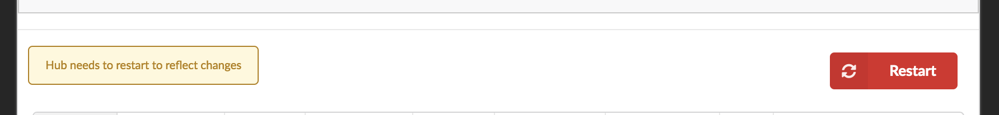

===========================================
Data plugin architecture and specifications
===========================================

**BioThings Studio** allows to easily define and register datasources using *data plugins*. Such a plugin is defined by:

 - a *manifest.json* file
 - other python files supporting the declaration in the manifest.

The plugin name, that is, the folder name containing the manifest file, gives the name to the resulting datasource.

A manifest file is defined like this:

.. code:: bash

	{
	    "version": "0.2",
	    "__metadata__" : { # optional
	        "url" : "<datasource website/url>",
	        "license_url" : "<url>",
	        "licence" : "<license name>",
            "author" : {
                "name" : "<author name>",
                "url" : "<link to github's author for instance>"
            }
	    },
	    "requires" : ["lib==1.3","anotherlib"],
	    "dumper" : {
	        "data_url" : "<url>" # (or list of url: ["<url1>", "<url1>"]),
	        "uncompress" : true|false, # optional, default to false
	        "release" : "<path.to.module>:<function_name>"  # optional
	        "schedule" : "0 12 * * *"  # optional
	    },
	    "uploader" : { # optional, a manifest is allowed to only have a "dumper" section
	        "parser" : "<path.to.module>:<function_name>",
	        "on_duplicates" : "ignore|error|merge" # optional, default to "error"
	    }
	}

.. note:: it's possible to only have a dumper section, without any uploader specified. In that case, the data plugin will only download data and won't provide
   any way to parse and upload data.

- a *version* defines the specification version the manifest is using. Currently, version 0.2 should be used. This is not the version of the datasource itself.
- an optional (but highly recommended) *__metadata__* key provides information about the datasource itself, such as a website, a link to its license, the license name.
  This information, when provided, are displayed in the /metadata endpoint of the resulting API.
- a *requires* section, optional, describes dependencies that should be installed for the plugin to work. This uses `pip` behind the scene, and each element of that list
  is passed to `pip install` command line. If one dependency installation fails, the plugin is invalidated. Alternately, a single string can be passed, instead of a list.
- a *dumper* section specifies how to download the actual data.

  * *data_url* specifies where to download the data from. It can be a URL (string) or a list of URLs (list of strings). Currently supported protocols are **http(s)** and **ftp**. 
    URLs must point to individual files (no wildcards) and only one protocol is allowed within a list of URLs (no mix of URLs using htttp and ftp are allowed). All files
    are download in a data folder, determined by ``config.DATA_ARCHIVE_ROOT``/<plugin_name>/<release>

  * *uncompress*: once downloaded, this flag, if set to true, will uncompress all supported archived found in the data folder.
    Currently supported format are: ``*.zip``, ``*.gz``, ``*.tar.gz`` (includes untar step)

  * *schedule* will trigger the scheduling of the dumper, so it automatically checks for new data on a regular basis. Format is the same as crontabs, with the
    addition of an optional sixth parameter for scheduling by the seconds.

    Ex: ``* * * * * */10`` will trigger the dumper every 10 seconds (unless specific use case, this is not recommanded).

    For more information, **Hub** relies on `aiocron`_ for scheduling jobs.

  * *release* optionally specifies how to determine the release number/name of the datasource. By default, if not present, the release will be set using:

    - ``Last-Modified`` header for an HTTP-based URL. Format: ``YYYY-MM-DD``
    - ``ETag`` header for an HTTP-based URL if ``Last-Modified`` isn't present in headers. Format: the actual etag hash.
    - ``MDTM`` ftp command if URL is FTP-based.

    If a list of URLs is specified in *data_url*, the last URL is the one used to determine the release.
    If none of those are available, or not satisfactory, a *release* section can be specified, and should point to a python module and a function name
    following this format: ``module:function_name``. Within this module, function has the following signature and should return the release, as a string.
    ``set_release`` is a reserver name and must not be used.

.. code:: python

   def function_name(self):
       # code
       return "..."

.. _`aiocron`: https://github.com/gawel/aiocron

``self`` refers to the actual dumper instance, that is, either a ``biothings.hub.dataload.dumper.HTTPDumper`` or a ``biothings.hub.dataload.dumper.FTPDumper`` depending
on the protocol. All properties, methods from the instance are available, specifically:

  * ``self.client``, the actual underlying client used to download files, which is either a ``request.Session`` or ``ftplib.FTP`` instance, and should be prefered
    over initializing a new connection/client.
  * ``self.SRC_URLS``, containing the list of URLs (if only one URL was specified in *data_url*, this will be a list of one element), which is commonly
    used to inspect and possibly determine the release.

- an *uploader* section specifies how to parse and store (upload):

  * *parser* key defined a module and a function name within that module. Format: ``module:function_name``. Function has the following signature and return a list of dictionary
  (or ``yield`` dictionaries) containing at least a ``_id`` key reprensenting a unique identifier (string) for this document:

.. code:: python

   def function_name(data_folder):
       # code
       yield {"_id":"..."}

``data_folder`` is the folder containing the previously downloaded (dumped) data, it is automatically set to the latest release available. Note the function doesn't
take an filename as input, it should select the file(s) to parse.

  * *on_duplicates* defines the strategy to use when duplicated record are found (according to the ``_id`` key):

    - ``error`` (default) will raise an exception if duplicates are found
    - ``ignore`` will skip any duplicates, only the first one found will be store
    - ``merge`` will merge existing document with the duplicated one. Refer to ``biothings.hub.dataload.storage.MergerStorage`` class for more.

  * *parallelizer* points to a ``module:function_name`` that can be used when the uploader can be parallelized. If multiple input files exist, using the
    exact same parser, the uploader can be parallelized using that option. The parser should take an input file as parameter, not a path to a folder. The parallizer
    function should return a list of tuples, where each tuple corresponds to the list of input parameters for the parser. ``jobs`` is a reserved name and must not
    be used.

  * *mapping* points to a ``module:classmethod_name`` that can be used to specify a custom ElasticSearch mapping. Class method must return a python dictionary with a
    valid mapping. ``get_mapping`` is a reserved name and must not be used. There's no need to add ``@classmethod`` decorator, **Hub** will take care of it, the first
    and only argument is a class. Ex:

.. code:: python

   def custom_mapping(cls):
       return {
           "root_field": {
                "properties": {
                    "subfield": {
                        "type": "text",
                    }
                }
            }
       }

.. note:: Please see https://github.com/sirloon/mvcgi for a simple plugin definition. https://github.com/sirloon/gwascatalog will show how to use
   the ``release`` key and https://github.com/sirloon/FIRE will demonstrate the parallelization in the uploader section.

