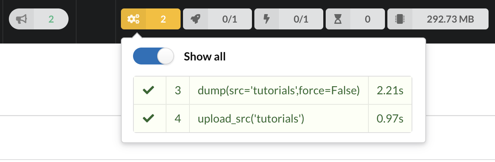
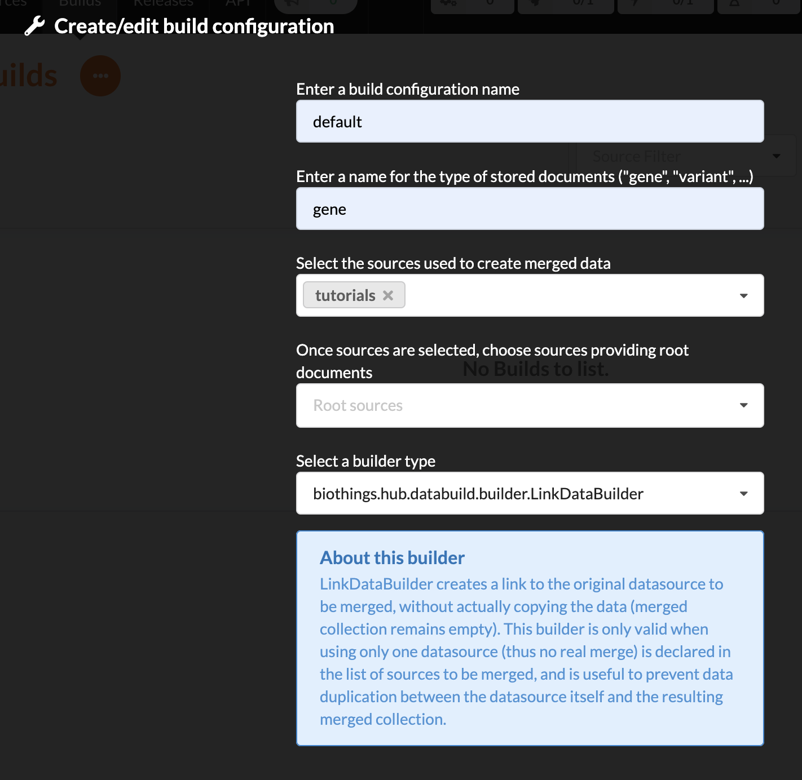
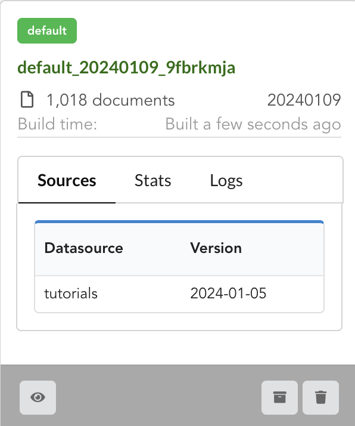
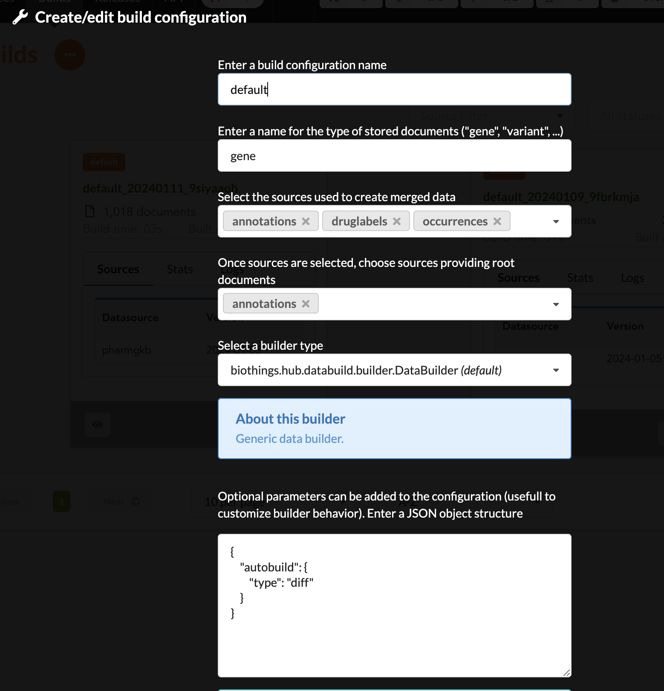

********
Tutorial
********

This tutorial will guide you through **BioThings Studio** by showing, in a first part, how to convert a simple flat file
to a fully operational BioThings API. In a second part, this API will enrich for more data.

.. note:: You may also want to read the `developer's guide <studio_guide.html>`_ for more detailed informations.

.. note:: The following tutorial is only valid for **BioThings Studio** release **0.2b**. Check
   all available `releases <https://github.com/biothings/biothings_studio/releases>`_ for more.

=================
What you'll learn
=================

Through this guide, you'll learn:

* how to obtain a Docker image to run your favorite API
* how to run that image inside a Docker container and how to access the **BioThings Studio** application
* how to integrate a new data source by defining a data plugin
* how to define a build configuration and create data releases
* how to create a simple, fully operational BioThings API serving the integrated data
* how to use multiple datasources and understand how data merge is done

=============
Prerequisites
=============

Using **BioThings Studio** requires a Docker server up and running, some basic knowledge
about commands to run and use containers. Images have been tested on Docker >=17. Using AWS cloud,
you can use our public AMI **biothings_demo_docker** (``ami-44865e3c`` in Oregon region) with Docker pre-configured
and ready for studio deployment. Instance type depends on the size of data you
want to integrate and parsers' performances. For this tutorial, we recommend using instance type with at least
4GiB RAM, such as ``t2.medium``. AMI comes with an extra 30GiB EBS volume, which is more than enough
for the scope of this tutorial.

Alternately, you can install your own Docker server (on recent Ubuntu systems, ``sudo apt-get install docker.io``
is usually enough). You may need to point Docker images directory to a specific hard drive to get enough space,
using ``-g`` option:

.. code:: bash

  # /mnt/docker points to a hard drive with enough disk space
  sudo echo 'DOCKER_OPTS="-g /mnt/docker"' >> /etc/default/docker
  # restart to make this change active
  sudo service docker restart

============
Installation
============

**BioThings Studio** is available as a Docker image that you can pull from our BioThings Docker Hub repository:

.. code:: bash

  $ docker pull biothings/biothings-studio:0.2b

A **BioThings Studio** instance expose several services on different ports:

* **8080**: **BioThings Studio** web application port
* **7022**: **BioThings Hub** SSH port
* **7080**: **BioThings Hub** REST API port
* **7081°°: **BioThings Hub** REST API port, read-only access
* **9200**: ElasticSearch port
* **27017**: MongoDB port
* **8000**: BioThings API, once created, it can be any non-priviledged (>1024) port
* **9000**: `Cerebro <https://github.com/lmenezes/cerebro>`_, a webapp used to easily interact with ElasticSearch clusters 
* **60080**: `Code-Server <https://github.com/cdr/code-server>`_, a webapp used to directly edit code in the container 

We will map and expose those ports to the host server using option ``-p`` so we can access BioThings services without
having to enter the container:

.. code:: bash

  $ docker run --rm --name studio -p 8080:8080 -p 7022:7022 -p 7080:7080 -p 7081:7081 -p 9200:9200 \
    -p 27017:27017 -p 8000:8000 -p 9000:9000 -p 60080:60080 -d biothings/biothings-studio:0.2b

.. note:: we need to add the release number after the image name: biothings-studio:**0.2b**. Should you use another release (including unstable releases,
   tagged as ``master``) you would need to adjust this parameter accordingly.

.. note:: Biothings Studio and the Hub are not designed to be publicly accessible. Those ports should **not** be exposed. When
   accessing the Studio and any of these ports, SSH tunneling can be used to safely access the services from outside.
   Ex: ``ssh -L 7080:localhost:7080 -L 8080:localhost:8080 user@mydockerserver`` will expose the web application,
   the REST API, Hub SSH and Cerebro app ports  to your computer, so you can access the webapp using http://localhost:8080, the API using http://localhost:7080,
   http://localhost:9000 for Cerebro, and directly type ``ssh -p 7022 biothings@localhost`` to access Hub's internals via the console.
   See https://www.howtogeek.com/168145/how-to-use-ssh-tunneling for more

We can follow the starting sequence using ``docker logs`` command:

.. code:: bash

  $ docker logs -f studio
  Waiting for mongo
  tcp        0      0 127.0.0.1:27017         0.0.0.0:*               LISTEN      -
  * Starting Elasticsearch Server
  ...
  Waiting for cerebro
  ...
  now run webapp
  not interactive

Please refer `Filesystem overview <studio_guide.html#filesystem-overview>`_ and  `Services check <studio_guide.html#services-check>`_ for
more details about Studio's internals.

By default, the studio will auto-update its source code to the latest version available and install all required dependencies. This behavior can be skipped
by adding ``no-update`` at the end of the command line of ``docker run ...``.

We can now access **BioThings Studio** using the dedicated web application (see `webapp overview <studio_guide.html#overview-of-biothings-studio-web-application>`_).

=========================
Part 1: single datasource
=========================

In this section we'll dive in more details on using the **BioThings Studio** and **Hub**. We will be integrating a simple flat file as a new datasource
within the **Hub**, declare a build configuration using that datasource, create a build from that configuration, then a data release and finally instantiate a new API service
and use it to query our data.

The whole source code is available at https://github.com/sirloon/pharmgkb, each branch pointing to a specific step in this tutorial.

Input data
^^^^^^^^^^

For this tutorial, we will use several input files provided by `PharmGKB <https://www.pharmgkb.org/>`_,
freely available in their `download <https://www.pharmgkb.org/downloads>`_ section, under "Annotation data":

* `annotations.zip`_: contains a file ``var_drug_ann.tsv`` about variant-gene-drug annotations. We'll use this file for the first part of this tutorial.
* `drugLabels.zip`_: contains a file ``drugLabels.byGene.tsv`` describing, per gene, which drugs have an impact of them
* `occurrences.zip`_: contains a file ``occurrences.tsv`` listing the literature per entity type (we'll focus on gene type only)

The last two files will be used in the second part of this tutorial when we'll add more datasources to our API.

.. _`annotations.zip`: https://s3.pgkb.org/data/annotations.zip
.. _`drugLabels.zip`: https://s3.pgkb.org/data/drugLabels.zip
.. _`occurrences.zip`: https://s3.pgkb.org/data/occurrences.zip

Parser
^^^^^^

In order to ingest this data and make it available as an API, we first need to write a parser. Data is pretty simple, tab-separated files, and we'll
make it even simpler by using ``pandas`` python library. The first version of this parser is available in branch ``pharmgkb_v1`` at
https://github.com/sirloon/pharmgkb/blob/pharmgkb_v1/parser.py. After some boiler plate code at the beginning for dependencies and initialization,
the main logic is the following:

.. code:: python

  def load_annotations(data_folder):

    results = {}
    for rec in dat:

        if not rec["Gene"] or pandas.isna(rec["Gene"]):
            logging.warning("No gene information for annotation ID '%s'", rec["Annotation ID"])
            continue
        _id = re.match(".* \((.*?)\)",rec["Gene"]).groups()[0]
        # we'll remove space in keys to make queries easier. Also, lowercase is preferred
        # for a BioThings API. We'll an helper function from BioThings SDK
        process_key = lambda k: k.replace(" ","_").lower()
        rec = dict_convert(rec,keyfn=process_key)
        results.setdefault(_id,[]).append(rec)

    for _id,docs in results.items():
        doc = {"_id": _id, "annotations" : docs}
        yield doc

Our parsing function is named ``load_annotations``, it could be name anything else, but it has to take a folder path ``data_folder``
containing the downloaded data. This path is automatically set by the Hub and points to the latest version available. More on this later.

.. code:: python

    infile = os.path.join(data_folder,"var_drug_ann.tsv")
    assert os.path.exists(infile)

It is the responsibility of the parser to select, within that folder, the file(s) of interest. Here we need data from a file named ``var_drug_ann.tsv``.
Following the moto "don't assume it, prove it", we make that file exists.

.. code:: python

    dat = pandas.read_csv(infile,sep="\t",squeeze=True,quoting=csv.QUOTE_NONE).to_dict(orient='records')
    results = {}
    for rec in dat:
       ...

We then open and read the TSV file using ``pandas.read_csv()`` function. At this point, a record ``rec`` looks like the following:

.. code:: bash

  {'Alleles': 'A',
   'Annotation ID': 608431768,
   'Chemical': 'warfarin (PA451906)',
   'Chromosome': 'chr1',
   'Gene': 'EPHX1 (PA27829)',
   'Notes': nan,
   'PMID': 19794411,
   'Phenotype Category': 'dosage',
   'Sentence': 'Allele A is associated with decreased dose of warfarin.',
   'Significance': 'yes',
   'StudyParameters': '608431770',
   'Variant': 'rs1131873'}

Keys are uppercase, for a BioThings API, we like to have them as lowercase. More importantly, we want to remove spaces in those keys
as querying the API in the end will be hard with spaces. We'll use a special helper from BioThings SDK to process these.

.. code:: python

      process_key = lambda k: k.replace(" ","_").lower()
      rec = dict_convert(rec,keyfn=process_key)

Finally, because there could be more than one record by gene (ie. more than one annotation per gene), we need to store those records as a list,
in a dictionary indexed by gene ID. The final documents are assembled in the last loop.

.. code:: python

      ...
      results.setdefault(_id,[]).append(rec)

   for _id,docs in results.items():
        doc = {"_id": _id, "annotations" : docs}
        yield doc

.. note:: The `_id` key is mandatory and represents a unique identifier for this document. The type must a string. The _id key is
   used when data from multiple datasources are merged together, that process is done according to its value
   (all documents sharing the same _id from different datasources will be merged together).

.. note:: In this specific example, we read the whole content of this input file in memory, when store annotations per gene. The data itself
   is small enough to do this, but memory usage always needs to cautiously considered when writing a parser.

Data plugin
^^^^^^^^^^^

Parser is ready, it's now time to glue everything together and build our API. We can easily create a new datasource and integrate data using
**BioThings Studio**, by declaring a `data plugin`. Such plugin is defined by:

* a folder containing a `manifest.json` file, where the parser and the input file location are declared
* all necessary files supporting the declarations in the manifest, such as a python file containing the parsing function for instance.

This folder must be located in the plugins directory (by default ``/data/biothings_studio/plugins``, where the **Hub** monitors changes and
reloads itself accordingly to register data plugins. Another way to declare such plugin is to register a github repository,
containing everything useful for the datasource. This is what we'll do in the following section.

.. note:: Whether the plugin comes from a github repository or directly found in the plugins directory doesn't really matter. In the end, the code
   will be found in that same ``plugins`` directory, whether it comes from a ``git clone`` command while registering the github URL or whether it comes
   from folder and files manually created in that location. It's however easier, when developing a plugin, to directly work on local files first
   so we don't have to regurlarly update the plugin code (``git pull``) from the webapp, to fetch the latest code. That said, since the plugin
   is already defined in github in our case, we'll use the github repo registration method.

The corresponding data plugin repository can be found at https://github.com/sirloon/pharmgkb/tree/pharmgkb_v1. The manifest file looks like this:

.. code:: bash

  {
      "version": "0.2",
      "requires" : ["pandas"],
      "dumper" : {
          "data_url" : ["https://s3.pgkb.org/data/annotations.zip",
                        "https://s3.pgkb.org/data/drugLabels.zip",
                        "https://s3.pgkb.org/data/occurrences.zip"],
          "uncompress" : true
      },
      "uploader" : {
          "parser" : "parser:load_annotations",
          "on_duplicates" : "error"
      }
  }

* `version` specifies the manifest version (it's not the version of the datasource itself) and tells the Hub what to expect from the manifest.
* parser uses ``pandas`` library, we declare that dependency in `requires` section.
* the `dumper` section declares where the input files are, using `data_url` key. In the end, we'll use 3 different files so a list of URLs is specified there. A single
  string is also allowed if only one file (ie. one URL) is required. Since the input file is a ZIP file, we first need to uncompress the archive, using `uncompress : true`.
* the `uploader` section tells the **Hub** how to upload JSON documents to MongoDB. `parser` has a special format, `module_name:function_name`. Here, the parsing function is named
  `load_annotations` and can be found in `parser.py` module. `'on_duplicates' : 'error'` tells the **Hub** to raise an error if we have documents with the same _id (it would
  mean we have a bug in our parser).

For more information about the other fields, please refer to the `plugin specification <studio_guide.html#data-plugin-architecture-and-specifications>`_.

Let's register that data plugin using the Studio. First, copy the repository URL:

.. image:: ../_static/githuburl.png
   :width: 100%

Moving back to the Studio, click on the |sources| tab, then |menu| icon, this will open a side bar on the left. Click on `New data plugin`, you will be asked to enter the github URL.
Click "OK" to register the data plugin.

.. image:: ../_static/registerdp.png
   :width: 100%

.. |sources| image:: ../_static/sources.png
   :width: 70px
.. |menu| image:: ../_static/menu.png
   :width: 70px

Interpreting the manifest coming with the plugin, **BioThings Hub** has automatically created for us:

* a `dumper` using HTTP protocol, pointing to the remote file on the CGI website. When downloading (or dumping)
  the data source, the dumper will automatically check whether the remote file is more recent than the one
  we may have locally, and decide whether a new version should be downloaded.
* and an `uploader` to which it "attached" the parsing function. This uploader will fetch JSON documents
  from the parser and store those in MongoDB.

At this point, the **Hub** has detected a change in the datasource code, as the new data plugin source code has been pulled from github locally inside the container.
In order to take this new plugin into account, the **Hub** needs to restart to load the code. The webapp should detect that reload and should ask whether we want to
reconnect, which we'll do!

.. image:: ../_static/hub_restarting.png
   :width: 250px

The Hub shows an error though:

.. image:: ../_static/nomanifest.png
   :width: 250px

Indeed, we fetch source code from branch ``master``, which doesn't contain any manifest file. We need to switch to another branch (this tutorial is organized using branches,
and also it's a perfect oportunity to learn how to use a specific branch/commit using **BioThings Studio**...)

Let's click on ``pharmgkb`` link, then |plugin|. In the textbox on the right, enter ``pharmgkb_v1`` then click on ``Update``.

.. |plugin| image:: ../_static/plugin.png
   :width: 70px

.. image:: ../_static/updatecode.png
   :width: 400px

**BioThings Studio** will fetch the corresponding branch (we could also have specified a commit hash for instance), source code changes will be detected and the Hub will restart.
The new code version is now visible in the plugin tab

.. image:: ../_static/branch.png
   :width: 400px

If we click back on |sources| PharmGKB appears fully functional, with different actions available:

.. image:: ../_static/listdp.png
   :width: 250px

* |dumpicon| is used to trigger the dumper and (if necessary) download remote data
* |uploadicon| will trigger the uploader (note it's automatically triggered if a new version of the data is available)
* |inspecticon| can be used to "inspect" the data, more of that later

.. |dumpicon| image:: ../_static/dumpicon.png
   :width: 25px
.. |uploadicon| image:: ../_static/uploadicon.png
   :width: 25px
.. |inspecticon| image:: ../_static/inspecticon.png
   :width: 25px

Let's open the datasource by clicking on its title to have more information. `Dumper` and `Uploader` tabs are rather empty since
none of these steps have been launched yet. Without further waiting, let's trigger a dump to integrate this new datasource.
Either go to `Dump` tab and click on |dumplabelicon| or click on |sources| to go back to the sources list and click on |dumpicon| at the bottom of the datasource.

.. |dumplabelicon| image:: ../_static/dumplabelicon.png
   :width: 75px

The dumper is triggered, and after few seconds, the uploader is automatically triggered. Commands can be listed by clicking at the top the page. So far
we've run 3 commands to register the plugin, dump the data and upload the JSON documents to MongoDB. All succeeded.

We also have new notifications as shown by the red number on the right. Let's have a quick look:

.. image:: ../_static/allnotifs.png
   :width: 450px

Going back to the source's details, we can see the `Dumper` has been populated. We now know the
release number, the data folder, when was the last download, how long it tooks to download the file, etc...

.. image:: ../_static/dumptab.png
   :width: 450px

Same for the `Uploader` tab, we now have 979 documents uploaded to MongoDB.

.. image:: ../_static/uploadtab.png
   :width: 450px

Inspection and mapping
^^^^^^^^^^^^^^^^^^^^^^

Now that we have integrated a new datasource, we can move forward. Ultimately, data will be sent to ElasticSearch, an indexing engine.
In order to do so, we need to tell ElasticSearch how the data is structured and which fields should be indexed (and which should not).
This step consists of creating a "mapping", describing the data in ElasticSearch terminology. This can be a tedious process as we would
need to dig into some tough technical details and manually write this mapping. Fortunately, we can ask **BioThings Studio** to inspect
the data and suggest a mapping for it.

In order to do so, click on `Mapping` tab, then click on |inspectlabelicon|.

.. |inspectlabelicon| image:: ../_static/inspectlabelicon.png
   :width: 75px

We can inspect the data for different purposes:

* **Mode**

  - ``type``: inspection will report any types found in the collection, giving detailed information about the structure
    of documents coming from the parser. Note results aren't available from the webapp, only in MongoDB.
  - ``stats``: same as type but gives numbers (count) for each structures and types found. Same as previous, results aren't available
    in the webapp yet.
  - ``mapping``: inspect the date types and suggest an ElasticSearch mapping. Will report any error or types incompatible with ES.

Here we'll stick to mode ``mapping`` to generate that mapping. There are other options used to explore the data to inspect:

* **Limit**: limit the inspected documents.
* **Sample**: randomize the documents to inspect (1.0 = consider all documents, 0.0 = skip all documents, 0.5 = consider every other documents)

The last two options can be used to reduce the inspection time of huge data collection, or you're absolutely sure the same structure is returned
for any documents output from the parser.

.. image:: ../_static/inspectmenu.png
   :width: 100%

Since the collection is very small, inspection is fast. But... it seems like we have a problem

.. image:: ../_static/inspecterr.png
   :width: 500px

`More than one type` was found for a field named ``notes``. Indeed, if we scroll down on the `pre-mapping` structure, we can see the culprit:

.. image:: ../_static/fielderr.png
   :width: 350px

This results means documents sometimes have ``notes`` key equal to ``NaN``, and sometimes equal to a string (a splittable string, meaning there are spaces in it).
This is a problem for ElasticSearch because it wouldn't how to index the data properly. And furthermore, ElasticSearch doesn't allow ``NaN`` values anyway. So we need
to fix the parser. The fixed version is available in branch ``pharmgkb_v2`` (go back to Plugin tab, enter that branch name and update the code).
The fix consists in `removing key/value <https://github.com/sirloon/pharmgkb/blob/pharmgkb_v2/parser.py#L24>`_ from the records, whenever a value is equal to ``NaN``.

.. code:: python

    rec = dict_sweep(rec,vals=[np.nan])

Once fixed, we need to re-upload the data, and inspect it again. This time, no error, our mapping is valid:

.. image:: ../_static/inspected.png
   :width: 500px

.. _fieldbydefault:

For each highlighted field, we can decide whether we want the field to be searchable or not, and whether the field should be searched
by default when querying the API. We can also change the type for that field, or even switch to "advanced mode" and specify your own set of indexing rules.
Let's click on "gene" field and make it searched by default. Let's also do the same for field "variant".

.. image:: ../_static/genefield.png
   :width: 100%

Indeed, by checking the "Search by default" checkbox, we will be able to search for instance gene symbol "ABL1" with ``/query?q=ABL1``
instead of ``/query?q=annotations.gene:ABL1``. Same for "variant" field where we can specify a rsid.

After this modification, you should see |edited| at the top of the mapping, let's save our changes clicking on |savelabelicon|. Also, before
moving forwared, we want to make sure the mapping is valid, let's click on |validatelabelicon|. You should see this success message:

.. |edited| image:: ../_static/edited.png
   :width: 50px
.. |savelabelicon| image:: ../_static/savelabelicon.png
   :width: 75px
.. |validatelabelicon| image:: ../_static/validatelabelicon.png
   :width: 150px

.. image:: ../_static/validated.png
   :width: 500px

.. note:: "Validate on test" means **Hub** will send the mapping to ElasticSearch by creating a temporary, empty index to make sure the mapping syntax
   and content are valid. It's immediately deleted after validation (wheter successful or not). Also, "test" is the name of an environment, by default,
   and without further manual configuration, this is the only development environment available in the Studio, pointing to embedded ElasticSearch server.

Everything looks fine, one last step is to "commit" the mapping, meaning we're ok to use this mapping as the official, registered mapping,
the one that will actually be used by ElasticSearch. Indeed the left side of the page is about inspected mapping, we can re-launch the
inspection as many time as we want, without impacting active/registered mapping (this is usefull when the data structure changes). Click on
|commit| then "OK", and you now should see the final, registered mapping on the right:

.. |commit| image:: ../_static/commit.png
   :width: 75px

.. image:: ../_static/registered.png
   :width: 450px

Build
^^^^^

Once we have integrated data and a valid ElasticSeach mapping, we can move forward by creating a build configuration. A `build configuration`
tells the **Hub** which datasources should be merged together, and how. Click on |builds| then |menu| and finally, click on |newbuildconf|.

.. |builds| image:: ../_static/builds.png
   :width: 75px
.. |newbuildconf| image:: ../_static/newbuildconf.png
   :width: 125px

* enter a `name` for this configuration. We're going to have only one configuration created through this tutorial so it doesn't matter, let's make it "default"
* the `document type` represents the kind of documents stored in the merged collection. It gives its name to the annotate API endpoint (eg. /gene). This source
  is about gene annotations, so "gene" it is...
* open the dropdown list and select the `sources` you want to be part of the merge. We only have one, "pharmgkb"
* in `root sources`, we can declare which sources are allowed to create new documents in the merged collection, that is merge documents from a
  datasource, but only if corresponding documents exist in the merged collection. It's usefull if data from a specific source relates to data on
  another source (it only makes sense to merge that relating data if the data itself is present). If root sources are declared, **Hub** will first
  merge them, then the others. In our case, we can leave it empty (no root sources specified, all sources can create documents in the merged collection)
* selecting a builder is optional, but the sake of this tutorial, we'll choose ``LinkDataBuilder``. This special builder will fetch documents directly from
  our datasources `pharmgkb` when indexing documents, instead of duplicating documents into another connection (called `target` or `merged` collection). We can
  do this (and save time and disk space) because we only have one datasource here.
* the other fields are for advanced usage and are out-of-topic for this tutorial

Click "OK" and open the menu again, you should see the new configuration available in the list.

.. image:: ../_static/buildconflist.png
   :width: 350px

Click on it and create a new build.

.. image:: ../_static/newbuild.png
   :width: 100%

You can give a specific name for that build, or let the **Hub** generate one for you. Click "OK", after few seconds, you should see the new build displayed on the page.

Open it by clicking on its name. You can explore the tabs for more information about it (sources involved, build times, etc...). The "Release" tab is the one we're going to use next.

Data release
^^^^^^^^^^^^

If not there yet, open the new created build and go the "Release" tab. This is the place where we can create new data releases. Click on |newrelease|.

.. |newrelease| image:: ../_static/newrelease.png
   :width: 90px

.. image:: ../_static/newreleaseform.png
   :width: 100%

Since we only have one build available, we can't generate an `incremental` release so we'll have to select `full` this time. Click "OK" to launch the process.

.. note:: Should there be a new build available (coming from the same configuration), and should there be data differences, we could generate an
   incremental release. In this case, **Hub** would compute a diff between previous and new builds and generate diff files (using `JSON diff`_ format).
   Incremental releases are usually smaller than full releases, usually take less time to deploy (appying diff data) unless diff content is too big
   (there's a threshold between using an incremental and a full release, depending on the hardware and the data, because applying a diff requires to first
   fetch the document from ElasticSearch, patch it, and then save it back)

.. _`JSON diff`: http://www.jsondiff.com/

**Hub** will directly index the data on its locally installed ElasticSearch server (``test`` environment). After few seconds, a new `full` release is created.

.. image:: ../_static/newfullrelease.png
   :width: 100%

We can easily access ElasticSearch server using the application **Cerebro** which comes pre-configured with the studio. Let's access it through http://localhost:9000/#/connect
(assuming ports 9200 and 9000 have properly been mapped, as mentioned earlier). **Cerebro** provides an easy to manager ElasticSearch and check/query indices.

Click on the pre-configured server named ``BioThings Studio``.

.. image:: ../_static/cerebro_connect.png
   :width: 350px

Clicking on an index gives access to different information, such as the mapping, which also contains metadata (sources involved in the build, releases, counts, etc...)

.. image:: ../_static/cerebro_index.png
   :width: 100%

API creation
^^^^^^^^^^^^

At this stage, a new index containing our data has been created on ElasticSearch, it is now time for final step. Click on |api| then |menu| and finally |newapi|

.. |api| image:: ../_static/api.png
   :width: 60px
.. |newapi| image:: ../_static/newapi.png
   :width: 100px

We'll name it `pharmgkb` and have it running on port 8000.

.. note:: Spaces are not allowed in API names

.. image:: ../_static/apiform.png
   :width: 450px

Once form is validated a new API is listed.

.. image:: ../_static/apilist.png
   :width: 300px

To turn on this API instance, just click on |playicon|, you should then see a |running| label on the top right corner, meaning the API
can be accessed:

.. |playicon| image:: ../_static/playicon.png
   :width: 25px
.. |running| image:: ../_static/running.png
   :width: 60px

.. image:: ../_static/apirunning.png
   :width: 300px

.. note:: When running, queries such ``/metadata`` and ``/query?q=*`` are provided as examples. They contain a hostname set by Docker though (it's the Docker instance hostname), which probably
   means nothing outside of Docker's context. In order to use the API you may need to replace this hostname by the one actually used to access the
   Docker instance.

Tests
^^^^^

Assuming API is accessible through http://localhost:8000, we can easily query it with ``curl`` for instance. The endpoint ``/metadata`` gives
information about the datasources and build date:

.. code:: bash

  $ curl localhost:8000/metadata
  {
    "biothing_type": "gene",
    "build_date": "2020-01-16T18:36:13.450254",
    "build_version": "20200116",
    "src": {
      "pharmgkb": {
        "stats": {
          "pharmgkb": 979
        },
        "version": "2020-01-05"
      }
    },
    "stats": {
      "total": 979
    }
  }

Let's query the data using a gene name (results truncated):

.. code:: bash

  $ curl localhost:8000/query?q=ABL1
  {
    "max_score": 7.544187,
    "took": 70,
    "total": 1,
    "hits": [
      {
        "_id": "PA24413",
        "_score": 7.544187,
        "annotations": [
          {
            "alleles": "T",
            "annotation_id": 1447814556,
            "chemical": "homoharringtonine (PA166114929)",
            "chromosome": "chr9",
            "gene": "ABL1 (PA24413)",
            "notes": "Patient received received omacetaxine, treatment had been stopped after two cycles because of clinical intolerance, but a major molecular response and total disappearance of the T315I clone was obtained. Treatment with dasatinib was then started and after 34-month follow-up the patient is still in major molecular response.",
            "phenotype_category": "efficacy",
            "pmid": 25950190,
            "sentence": "Allele T is associated with response to homoharringtonine in people with Leukemia, Myelogenous, Chronic, BCR-ABL Positive as compared to allele C.",
            "significance": "no",
            "studyparameters": "1447814558",
            "variant": "rs121913459"
          },
          {
            "alleles": "T",
            "annotation_id": 1447814549,
            "chemical": "nilotinib (PA165958345)",
            "chromosome": "chr9",
            "gene": "ABL1 (PA24413)",
            "phenotype_category": "efficacy",
            "pmid": 25950190,
            "sentence": "Allele T is associated with resistance to nilotinib in people with Leukemia, Myelogenous, Chronic, BCR-ABL Positive as compared to allele C.",
            "significance": "no",
            "studyparameters": "1447814555",
            "variant": "rs121913459"
          }
        ]
      }
    ]
  }

.. note:: We don't have to specify ``annotations.gene``, the field in which the value "ABL1" should be searched, because we explicitely asked ElasticSearch
   to search that field by default (see fieldbydefault_)

Finally, we can fetch a variant by its PharmGKB ID:

.. code:: bash

  $ curl "localhost:8000/gene/PA134964409"
  {
    "_id": "PA134964409",
    "_version": 1,
    "annotations": [
      {
        "alleles": "AG + GG",
        "annotation_id": 1448631680,
        "chemical": "etanercept (PA449515)",
        "chromosome": "chr1",
        "gene": "GBP6 (PA134964409)",
        "phenotype_category": "efficacy",
        "pmid": 28470127,
        "sentence": "Genotypes AG + GG is associated with increased response to etanercept in people with Psoriasis as compared to genotype AA.",
        "significance": "yes",
        "studyparameters": "1448631688",
        "variant": "rs928655"
      }
    ]
  }

Conclusions
^^^^^^^^^^^

We've been able to easily convert a remote flat file to a fully operational BioThings API:

* by defining a data plugin, we told the **BioThings Hub** where the remote data was and what the parser function was
* **BioThings Hub** then generated a `dumper` to download data locally on the server
* It also generated an `uploader` to run the parser and store resulting JSON documents
* We defined a build configuration to include the newly integrated datasource and then trigger a new build
* Data was indexed internally on local ElasticSearch by creating a full release
* Then we created a BioThings API instance pointing to that new index

The next step is to enrich that existing API with more datasources.

============================
Part 2: multiple datasources
============================

In the previous part, we generated an API from a single flat file. This API serves data about gene annotations, but we need more: as mentioned earlier in **Input data**,
we also downloaded drug labels and publications information. Integrating those unused files, we'll be able to enrich our API even more, that's the goal of this second part.

Data plugin limitations
^^^^^^^^^^^^^^^^^^^^^^^

The **data plugin architecture** provided by **BioThings Studio** allows to quickly integrate a new datasource, describing where the data is located, and how the data should be parsed.
It provides a simple and generic way to do so, but also comes with some limitations. Indeed, only one *uploader* can be specificed. In our case, we have one *dumper* responsible for
downloading three different files, and we now need three different *uploaders* in order to process these files. With our data plugin, only one file is parsed. In order to proceed
further, we need to manually write dumper and uploaders code...

.. note:: We could also process all three files in one single parser, that is, one single uploder, but for the sake of this tutorial, we'll proceed individually. Files can also
   be updated at different times, keeping uploaders separated helps maintaining data up-to-date without having to process all files at once each time.

Luckily, **BioThings Studio** provides an easy to export python code that has been generated during data plugin registration. Indeed, code is generated from the manifest file, compiled
and injected into **Hub**'s memory. Exporting the code consists in writing down that dynamically generated code.

Code export
^^^^^^^^^^^

Let's go back to our datasource, **Plugin** tab. Clicking on |exportcode| brings the following form:

.. |exportcode| image:: ../_static/exportcode.png
   :width: 100px

.. image:: ../_static/exportform.png
   :width: 100%

We have different options regarding the parts we can export:

* ``Dumper``: exports code responsible for downloading the data, according to URLs defined in the manifest.
* ``Uploader``: exports code responsible for data integration, using our parser code.
* ``Mapping``: any mapping generated from inspection, and registered (commit) can also be exported. It'll be part of the uploader.

We'll export all these parts, let's validate the form. Export results are displayed (though quickly as Hub will detect changes in the code and will want to restart)

.. image:: ../_static/exportedcode.png
   :width: 100%

We can see the relative paths where code was exported. A message about ``ACTIVE_DATASOURCES`` is also displayed explaining how to activate our newly exported datasource. That said,
**BioThings Studio** by default monitors speficic locations for code changes, including where code is exported, so we don't need to manually activate it. That's also the reason why
**Hub** has been restarted.

Once reconnected, if we go back on |sources|, we'll see an error!

.. image:: ../_static/pluginvsexport.png
   :width: 250px

Our original data plugin can't registered (ie. activated) because another datasource with the same name is already registered. That's our new exported datasource! When the **Hub** starts,
it first loads datasources which have been manually coded (or exported), and then data plugins. Both our plugin and exported code is active, but the **Hub** can't know which one to use.
Let's delete the plugin, by clicking on |trash|, and confirm the deletion.

.. |trash| image:: ../_static/trash.png
   :width: 30px

**Hub** will restart again (reload page if not) and this time, our datasource is active. If we click on ``pharmgkb``, we'll see the same details as before except the ``Plugin`` tab which
disappeared. So far, our exported code runs, and we're in the exact same state as before, the **Hub** even kept our previously dumped/uploaded data.

Let's explore the source code that has been generated through out this process. Let's enter our docker container, and become user ``biothings`` (from which everything runs):

.. code:: bash

  $ docker exec -ti studio /bin/bash
  $ sudo su - biothings

Paths provided as export results (``hub/dataload/sources/*``) are relative to the started folder named ``biothings_studio``. Let's move there:

.. code:: bash

  $ cd biothings_studio/hub/dataload/sources/
  $ ls -la
  total 0
  -rw-rw-r-- 1 biothings biothings   0 Jan 15 23:41 __init__.py
  drwxrwxr-x 2 biothings biothings  45 Jan 15 23:41 __pycache__
  drwxr-xr-x 1 biothings biothings  75 Jan 15 23:41 ..
  drwxr-xr-x 1 biothings biothings  76 Jan 22 19:32 .
  drwxrwxr-x 3 biothings biothings 154 Jan 22 19:32 pharmgkb

A ``pharmgkb`` folder can be found and contains the exported code:

.. code:: bash

  $ cd pharmgkb
  $ ls
  total 32
  drwxrwxr-x 3 biothings biothings   154 Jan 22 19:32 .
  drwxr-xr-x 1 biothings biothings    76 Jan 22 19:32 ..
  -rw-rw-r-- 1 biothings biothings 11357 Jan 22 19:32 LICENSE
  -rw-rw-r-- 1 biothings biothings   225 Jan 22 19:32 README
  -rw-rw-r-- 1 biothings biothings    70 Jan 22 19:32 __init__.py
  drwxrwxr-x 2 biothings biothings   142 Jan 22 19:45 __pycache__
  -rw-rw-r-- 1 biothings biothings   868 Jan 22 19:32 dump.py
  -rw-rw-r-- 1 biothings biothings  1190 Jan 22 19:32 parser.py
  -rw-rw-r-- 1 biothings biothings  2334 Jan 22 19:32 upload.py

Some files were copied from data plugin repository (``LICENCE``, ``README`` and ``parser.py``), the others are the exported ones:  ``dump.py`` for the dumper, ``upload.py``
for the uploader and the mappings, and ``__init__.py`` so the **Hub** can find these components upon start. We'll go in further details later, specially when we'll add more
uploaders.

For conveniency, the exported code can be found in branch ``pharmgkb_v3`` available at https://github.com/sirloon/pharmgkb/tree/pharmgkb_v3. One easy way to follow
this tutorial without having to type too much is to replace folder ``pharmgkb`` with a clone from Git repository. The checked out code is exactly the same as code after export.

.. code:: bash

  $ cd ~/biothings_studio/hub/dataload/sources/
  $ rm -fr pharmgkb
  $ git clone https://github.com/sirloon/pharmgkb.git
  $ cd pharmgkb
  $ git checkout pharmgkb_v3

More uploaders
^^^^^^^^^^^^^^

Now that we have exported the code, we can start the modifications. The final code can be found on branch https://github.com/sirloon/pharmgkb/tree/pharmgkb_v4.

.. note:: We can directly point to that branch using ``git checkout pharmgkb_v4`` within the datasource folder previously explored.

First we'll write two more parsers, one for each addition files. Within ``parser.py``:

* at the beginning, ``load_annotations`` is the first parser we wrote, no changes required
* ``load_druglabels`` function is responsible for parsing file named ``drugLabels.byGene.tsv``
* ``load_occurrences`` function is parsing file ``occurrences.tsv``

Writing parsers is not the main purpose of this tutorial, which focuses more on how to use **BioThings Studio**, so we won't go into further details.

Next is about defining new uploaders. In ``upload.py``, we currently have one uploader definition, which looks like this:

.. code:: python

  class PharmgkbUploader(biothings.hub.dataload.uploader.BaseSourceUploader):

      name = "pharmgkb"
      __metadata__ = {"src_meta": {}}
      idconverter = None
      storage_class = biothings.hub.dataload.storage.BasicStorage
  ...

The important pieces of information here is ``name``, which gives the name of the uploader we define. Currently uploader is named ``pharmgkb``.
That's how this name is displayed in the "Upload" tab of the datasource. We know we need three uploaders in the end so we need to adjust names. In order to do so, we'll define
a main source, ``pharmgkb``, then three different other "sub" sources: ``annotations``, ``druglabels`` and ``occurrences``. For clarity, we'll put these uploaders in three different files.
As a result, we now have:

* file ``upload_annotations.py``, originally coming from the code export. Class definition is:

.. code:: python

  class AnnotationsUploader(biothings.hub.dataload.uploader.BaseSourceUploader):

    main_source = "pharmgkb"
    name = "annotations"

.. note:: We renamed the class itself, ``pharmgkb`` is now set as field ``main_source``. This name matches the dumper name as well, which is how the **Hub** knows how dumpers and uploaders relates
   to each others. Finally, the sub-source named ``annotation`` is set as field ``name``.

* doing the same for ``upload_druglabels.py``:

.. code:: python

  from .parser import load_druglabels

  class DrugLabelsUploader(biothings.hub.dataload.uploader.BaseSourceUploader):

    main_source = "pharmgkb"
    name = "druglabels"
    storage_class = biothings.hub.dataload.storage.BasicStorage

    def load_data(self, data_folder):
        self.logger.info("Load data from directory: '%s'" % data_folder)
        return load_druglabels(data_folder)

    @classmethod
    def get_mapping(klass):
        return {}

.. note:: In addition to adjusting the names, we need to import our dedicated parser, ``load_druglabels``. Following what the **Hub** did during code export, we "connect" that parser to this
   uploader in method ``load_data``. Finally, each uploader needs to implement class method ``get_mapping``, currently an empty dictionary, that is, no mapping at all. We'll fix this soon.

* finally, ``upload_occurences.py`` will deal with occurences uploader. Code is similar as previous one.

.. code:: python

  from .parser import load_occurrences

  class OccurrencesUploader(biothings.hub.dataload.uploader.BaseSourceUploader):

      main_source = "pharmgkb"
      name = "occurrences"
      storage_class = biothings.hub.dataload.storage.BasicStorage

      def load_data(self, data_folder):
          self.logger.info("Load data from directory: '%s'" % data_folder)
          return load_occurrences(data_folder)

      @classmethod
      def get_mapping(klass):
          return {}

The last step to activate those components is to expose them through the ``__init__.py``:

.. code:: python

  from .dump import PharmgkbDumper
  from .upload_annotations import AnnotationsUploader
  from .upload_druglabels import DrugLabelsUploader
  from .upload_occurrences import OccurrencesUploader

Upon restart, the "Upload" tab now looks like this:

.. image:: ../_static/moreuploaders.png
   :width: 500px

We still have an uploader named ``pharmgkb``, but that component has been deleted! **Hub** indeed kept information within its internal database, but also detected that
the actual uploader class doesn't exists anymore (see message ``No uploader found, datasource may be broken``). In that specific case, an option to delete that internal information
is provided, let's clock on the closing button on that tab to remove that information.

If we look at the other uploader tabs, we don't see much information, that's because they haven't been launched yet. For each on them, let's click on "Upload" button.

.. note:: Another way to trigger all uploaders at once is to click on |sources| to list all datasources, then click on |uploadicon| for that datasource in particular.

After a while, all uploaders have run, data is populated, as shown in the different tabs.

More data inspection
^^^^^^^^^^^^^^^^^^^^

Data is ready, it's now time to inspect the data for the new uploaders. Indeed, if we check the "Mapping" tab, we still have the old mapping from the original ``pharmgkb`` uploader
(we can remove that "dead" mapping by clicking on the closing button of the tab), but nothing for uploaders ``druglabels`` and ``occurences``.

Looking back at the uploaders' code, ``get_mapping`` class method was defined such as it returns an empty mapping. That's the reason why we don't have anything shown here,
let's fix that by click on |inspectlabelicon|. After few seconds, mappings are generated, we can review them, and click on |commit| to validate and register those mappings, for
each tab.

Modifying build configuration
^^^^^^^^^^^^^^^^^^^^^^^^^^^^^

All data is now ready, as well as mappings, it's time to move forward and build the merged data. We now have three differents source for documents, and we need to merge them
together. **Hub¨** will do so according to field ``_id``: if two documents from different sources share the same ``_id``, they are merged together (think about dictionary merge).

In order to proceed further, we need to update our build configuration, as there's currently
only datasource involved in the merge. Clicking on |builds|, then |menu| we can edit existing configuration.

.. image:: ../_static/editbuildconf.png
   :width: 300px

There several parameters we need to adjust:

* first, since original ``pharmgkb`` uploader doesn't anymore, that datasource isn't listed anymore
* in the other hand, we now have our three new datasources, and we need to select all of them
* our main data is coming from ``annotations``, and we want to enrich this data with druglabels and litterature occurrences. But only if data first exists in ``annotations``.
  Behing this requirement is the notion of *root documents*. When selection ``annotations`` as a source for root documents, we tell the **Hub** to first merge that data, then
  merge the other sources **only** if a document from ``annotations`` with the same _id exists. If not, documents are silently ignored.
* finally, we were previously using a ``LinkDataBuilder`` because we only had one datasource (data wasn't copied, but refered, or linked to the original datasource collection). We now
  have three datasources involved in the merge so we can't use that builder anymore and need to switch to the default ``DataBuilder`` one. If not, **Hub** will complain and deactivate
  the build configuration until it's fixed.

The next configuration is summarized in the following picture:

Upon validation, build configuration is ready to be used.

Incremental release
^^^^^^^^^^^^^^^^^^^

Configuration reflects our changes and is up-to-date, let's create a new build. Click on |menu| if not already open, then "Create a new build"

.. image:: ../_static/buildconflist.png
   :width: 350px

After few seconds, we have a new build listed. Clicking on "Logs" will show how the **Hub** created it. We can see it first merged ``annotations``
in the "merge-root" step (for *root documents*), then ``druglabels`` and ``occurrences`` sources. The remaining steps, (*diff*, *release note*) were
automatically triggered by the **Hub**. Let's explore these further.

.. image:: ../_static/buildlogs.png
   :width: 300px

If we open the build and click on "Releases" tab, we have a *diff* release, or *incremental* release, as mentioned in the "Logs". Because a previous release existed for
that build configuration (the one we did in part one), the **Hub** tries to compute an release comparing the two together, identifying new, deleted and updated documents.
The result is a *diff* release, based on **json diff** format.

.. image:: ../_static/diffrelease.png
   :width: 450px

In our case, one diff file has been generated, its size is 2 MiB, and contains information to update 971 documents. This is expected since we enriched our existing data. **Hub** also
mention the mapping has been changed, and these will be reported to the index as we "apply" that diff release.

.. note:: Because we added new datasources, without modifying existing mapping in the first ``annotations`` source, the differences between previous and new mappings correspond to
   "add" json-diff operations. This means we strictly only add **more** information to the existing mapping. If we'd removed, and modify existing mapping fields, the **Hub** would
   have reported an error and aborted the generation of that diff release, to prevent an error during the update of the ElasticSearch index, or to avoid data inconsistency.

The other document that has been automatically generated is a *release note*.

.. image:: ../_static/genrelnote.png
   :width: 300px

If we click on "View", we can see the results: the **Hub** compared previous data versions and counts, deleted and added datasources and field, etc...
In other words, a "change log" summarizing what happened betwen previous and new releases. These release notes are informative, but also can be published
when deploying data releases (see part 3).

.. image:: ../_static/relnote.png
   :width: 600px

Let's apply that diff release, by clicking on |applydiff|

.. |applydiff| image:: ../_static/applydiff.png
   :width: 30px

We can select which index to update, from a dropdown list. We only have index, the one we created earlier in part 1. That said, **Hub** will do its best to filter out any incompatible
indices, such those not coming from the same build configuration, or not having the same document type.

.. image:: ../_static/applydiffform.png
   :width: 500px

Once confirmed, the synchronization process begins, diff files are applied to the index, just as if we were "patching" data. We can track the command execution from the command list, and
also from the notification popups when it's done.

.. image:: ../_static/commanddiff.png
   :width: 500px

.. image:: ../_static/notifdiff.png
   :width: 500px

Our index, currently served by our API defined in the part 1, has been updated, using a diff, or incremental, release. It's time to have a look at the data.

Testing final API
^^^^^^^^^^^^^^^^^^^^^^^^^^^^^^

Because we directly apply a diff, or patch our data, on ElasticSearch index, we don't need to re-create an API. Querying the API should just transparently reflect that "live" update.
Time to try our new enriched API. We'll use ``curl`` again, here few query examples:

.. code:: bash

  $ curl localhost:8000/metadata
  {
  "biothing_type": "gene",
  "build_date": "2020-01-24T00:14:28.112289",
  "build_version": "20200124",
  "src": {
    "pharmgkb": {
      "stats": {
        "annotations": 979,
        "druglabels": 122,
        "occurrences": 5503
      },
      "version": "2020-01-05"
    }
  },
  "stats": {
    "total": 979
  }

Metadata has changed, as expected. If we compare this result with previous one, we now have three different sources: ``annotations``, ``druglabels`` and ``occurrences``,
reflecting our new uploaders. For each of them, we have the total number of documents involved during the merge. Interestingly, the total number of documents is in our case 979 but,
for instance, ``occurrences`` shows 5503 documents. Remember, we set ``annotations`` as a *root documents* source, meaning documents from others are merged only if they matched (based on ``_id`` field)
an existing documents in this *root document* source. In other words, with this specific build configuration, we can't have more documents in the final API than the number of documents in
*root document* sources.

Let's query by symbol name, just as before:

.. code:: bash

  $ curl localhost:8000/query?q=ABL1
  {
  "max_score": 7.544187,
  "took": 2,
  "total": 1,
  "hits": [
    {
      "_id": "PA24413",
      "_score": 7.544187,
      "annotations": [
        {
          "alleles": "T",
          "annotation_id": 1447814556,
          "chemical": "homoharringtonine (PA166114929)",
          "chromosome": "chr9",
          "gene": "ABL1 (PA24413)",
          "notes": "Patient received received omacetaxine, treatment had been stopped after two cycles because of clinical intolerance, but a major molecular response and total disappearance of theT315I clone was obtained. Treatment with dasatinib was then started and after 34-month follow-up the patient is still in major molecular response.",
          "phenotype_category": "efficacy",
          "pmid": 25950190,
          "sentence": "Allele T is associated with response to homoharringtonine in people with Leukemia, Myelogenous, Chronic, BCR-ABL Positive as compared to allele C.",
          "significance": "no",
          "studyparameters": "1447814558",
          "variant": "rs121913459"
        },
        ...
            ],
        "drug_labels": [
            {
              "id": "PA166117941",
              "name": "Annotation of EMA Label for bosutinib and ABL1,BCR"
            },
            {
              "id": "PA166104914",
              "name": "Annotation of EMA Label for dasatinib and ABL1,BCR"
            },
            {
              "id": "PA166104926",
              "name": "Annotation of EMA Label for imatinib and ABL1,BCR,FIP1L1,KIT,PDGFRA,PDGFRB"
            },
            ...
            ]
        "occurrences": [
            {
              "object_id": "PA24413",
              "object_name": "ABL1",
              "object_type": "Gene",
              "source_id": "PMID:18385728",
              "source_name": "The cancer biomarker problem.",
              "source_type": "Literature"
            },
            {
              "object_id": "PA24413",
              "object_name": "ABL1",
              "object_type": "Gene",
              "source_id": "PMC443563",
              "source_name": "Two different point mutations in ABL gene ATP-binding domain conferring Primary Imatinib resistance in a Chronic Myeloid Leukemia (CML) patient: A case report.",
              "source_type": "Literature"
            },
            ...
            ]
    }

We new have much information associated (much have been remove for clarity), including keys ``drug_labels`` and ``occurrences`` coming the two new uploaders.

Conclusions
^^^^^^^^^^^

Moving from a single datasource based API, previously defined as a data plugin, we've been able to export this data plugin code. This code was used as a base
to extend our API, specifically:

* we implemented two more parsers, and their counter-part uploaders.
* we updated the build configuration to add these new datasources
* we created a new index (*full* release) and created a new API serving this new data.

So far APIs are running from within **BioThings Studio**, and data still isn't exposed to the public. The next step to publish this data and make the API available
for everyone.

.. note:: **BioThings Studio** is a backend service, aimed to be used internally to prepare, test and release APIs. It is not inteneded to be facing public internet, in other words,
   it's not recommended to expose any ports, including API ports, to public-facing internet.

=========================================
Part 3: API cloud deployments and hosting
=========================================

This part is still under development... Stay tuned and join Biothings Google Groups (https://groups.google.com/forum/#!forum/biothings) for more.

===============
Troubleshooting
===============

We test and make sure, as much as we can, that the **BioThings Studio** image is up-to-date and running properly. But things can still go wrong...

A good starting point investigating an issue is to look at the logs from the **BioThings Studio**. Make sure connected (green power button on the top right),
then click "Logs" button, on the bottom right. You will see logs in real-time (if not connected, it will complain about a disconnected websocket). As you click
and perform actions through out the web application, you will see log message in that windows, and potentially errors not displayed (or with less details) in the
application.

.. image:: ../_static/logs.png
   :width: 500px

The "Terminal" (click on the bottom left button). gives access to commands you can manually type from the web application. Basically, any action performed clicking on the application
is converted into a command call. You can even see what commands were launched, which ones are running. This terminal gives also access to more commands, and advanced options that may
be useful to troubleshoot an issue. Typing ``help()``, or even passing a command name such as ``help(dump)`` will print documentation on available commands and how to use them.

.. image:: ../_static/term.png
   :width: 500px

On a lower level, make sure all services are running in the docker container. Enter the container with
``docker exec -ti studio /bin/bash`` and type ``netstat -tnlp``, you should see services running on ports
(see usual running `services <studio_guide.html#services-check>`_). If services running on ports 7080 or 7022 aren't running, it means the
**Hub** has not started. If you just started the instance, wait a little more as services may take a while
before they're fully started and ready.

If after ~1 min, you still don't see the **Hub** running, log to user ``biothings`` and check the starting sequence.

.. note:: **Hub** is running in a tmux session, under user ``biothings``

.. code:: bash

   # sudo su - biothings
   $ tmux a # recall tmux session

   $ python bin/hub.py
   DEBUG:asyncio:Using selector: EpollSelector
   INFO:root:Hub DB backend: {'uri': 'mongodb://localhost:27017', 'module': 'biothings.utils.mongo'}
   INFO:root:Hub database: biothings_src
   DEBUG:hub:Last launched command ID: 14
   INFO:root:Found sources: []
   INFO:hub:Loading data plugin 'https://github.com/sirloon/mvcgi.git' (type: github)
   DEBUG:hub:Creating new GithubAssistant instance
   DEBUG:hub:Loading manifest: {'dumper': {'data_url': 'https://www.cancergenomeinterpreter.org/data/cgi_biomarkers_latest.zip',
               'uncompress': True},
    'uploader': {'ignore_duplicates': False, 'parser': 'parser:load_data'},
    'version': '0.1'}
   INFO:indexmanager:{}
   INFO:indexmanager:{'test': {'max_retries': 10, 'retry_on_timeout': True, 'es_host': 'localhost:9200', 'timeout': 300}}
   DEBUG:hub:for managers [<SourceManager [0 registered]: []>, <AssistantManager [1 registered]: ['github']>]
   INFO:root:route: ['GET'] /job_manager => <class 'biothings.hub.api.job_manager_handler'>
   INFO:root:route: ['GET'] /command/([\w\.]+)? => <class 'biothings.hub.api.command_handler'>
   ...
   INFO:root:route: ['GET'] /api/list => <class 'biothings.hub.api.api/list_handler'>
   INFO:root:route: ['PUT'] /restart => <class 'biothings.hub.api.restart_handler'>
   INFO:root:route: ['GET'] /status => <class 'biothings.hub.api.status_handler'>
   DEBUG:tornado.general:sockjs.tornado will use json module
   INFO:hub:Monitoring source code in, ['/home/biothings/biothings_studio/hub/dataload/sources', '/home/biothings/biothings_studio/plugins']:
   ['/home/biothings/biothings_studio/hub/dataload/sources',
    '/home/biothings/biothings_studio/plugins']

You should see something looking like this above. If not, you should see the actual error, and depending on the error, you may be able to
fix it (not enough disk space, etc...). **BioThings Hub** can be started again using ``python bin/hub.py`` from within the application
directory (in our case, ``/home/biothings/biothings_studio``)

.. note:: Press Control-B then D to dettach the tmux session and let the **Hub** running in background.

By default, logs are available in ``/data/biothings_studio/logs/``.

Finally, you can report issues and request for help, by joining Biothings Google Groups (https://groups.google.com/forum/#!forum/biothings)

