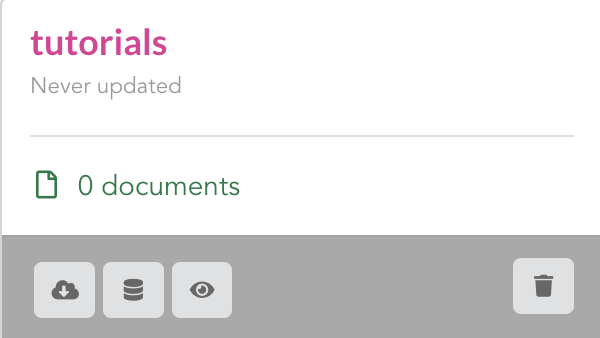

#########################
BioThings Studio tutorial
#########################

This tutorial will guide you through **BioThings Studio**, a pre-configured environment used to build
and administer BioThings API. This guide will show how to convert a simple flat file
to a fully operational BioThings API, with as minimal effort as possible.

.. note:: You may also want to read the `developer's guide <studio_guide.html>`_ for more detailed informations.

.. note:: The following tutorial is only valid for **BioThings Studio** release **0.1.e**. Check
   all available `release <https://github.com/biothings/biothings_studio/releases>`_ for more.

*****************
What you'll learn
*****************

Through this guide, you'll learn:

* how to obtain a Docker image to run your favorite API
* how to run that image inside a Docker container and how to access the **BioThings Studio** application
* how to integrate a new data source by defining a data plugin
* how to define a build configuration and create data releases
* how to create a simple, fully operational BioThings API serving the integrated data

****************************************
Downloading and running BioThings Studio
****************************************

**BioThings Studio** is available as a Docker image that you can download following this `link`_ using your favorite web browser or ``wget``:

.. _link: http://biothings-containers.s3-website-us-west-2.amazonaws.com/biothings_studio/biothings_studio_latest.docker

.. code:: bash

  $ wget http://biothings-containers.s3-website-us-west-2.amazonaws.com/biothings_studio/biothings_studio_latest.docker

You must have a running Docker server in order to use that image. Typing ``docker ps`` should return all running containers, or
at least an empty list as in the following example. Depending on the systems and configuration, you may have to add ``sudo``
in front of this command to access Docker server.

.. code:: bash

  $ docker ps
    CONTAINER ID        IMAGE               COMMAND                  CREATED             STATUS              PORTS      NAMES

Once downloaded, the image can be loaded into the server:

.. code:: bash

  $ docker image load < biothings_studio_latest.docker
  $ docker image list
  REPOSITORY          TAG                 IMAGE ID            CREATED             SIZE
  biothings_studio    latest              742a8c502280        2 months ago        1.81 GB

A **BioThings Studio** instance expose several services on different ports:

* **8080**: **BioThings Studio** web application port
* **7022**: **BioThings Hub** SSH port
* **7080**: **BioThings Hub** REST API port
* **9200**: ElasticSearch port
* **27017**: MongoDB port
* **8000**: BioThings API, once created, it can be any non-priviledged (>1024) port
* **8000**: BioThings API, once created, it can be any non-priviledged (>1024) port

We will map and expose those ports to the host server using option ``-p`` so we can access BioThings services without
having to enter the container:

.. code:: bash

  $ docker run --name studio -p 8080:8080 -p 7022:7022 -p 7080:7080 -p 9200:9200 -p 27017:27017 -p 8000:8000 -d biothings_studio

.. note:: Biothings Studio and the Hub are not designed to be publicly accessible. Those ports should **not** be exposed. When
   accessing the Studio and any of these ports, SSH tunneling can be used to safely access the services from outside.
   Ex: ``ssh -L 7080:localhost:7080 -L 8080:localhost:8080 user@mydockerserver`` will expose the web application and
   the REST API ports to your computer, so you can access the webapp using http://localhost:8080 and the API using http://localhost:7080.
   See https://www.howtogeek.com/168145/how-to-use-ssh-tunneling for more

Filesystem overview
^^^^^^^^^^^^^^^^^^^

Several locations on the filesystem are important to notice, when it comes to change default configuration or troubleshoot the application.

* **Hub** (backend service) is running under ``biothings`` user, running code is located in ``/home/biothings/biothings_studio``. It heavely relies on
  BioThings SDK located in ``/home/biothings/biothings.api``.
* Several scripts/helpers can be found in ``/home/biothings/bin``:

  - ``run_studio`` is used to run the Hub in a tmux session. If a session is already running, it will first kill it and create new one. We don't have
    to run this manually when the studio first starts, it is part of the starting sequence.
  - ``update_studio`` is used to fetch the latest code for **BioThings Studio**
  - ``update_biotnings``, same as above but for BioThings SDK

* ``/data`` contains several important folders:

  - ``mongodb`` folder, where MongoDB server stores its data
  - ``elasticsearch`` folder, where ElasticSearch stores its data
  - ``biothings_studio`` folder, containing different sub-folders used by the **Hub**

    - ``datasources`` contains data downloaded by the different ``dumpers``, it contains sub-folders named according to the datasource's name.
      Inside the datasource folder can be found the different releases, one per folder.
    - ``dataupload`` is where data is stored when uploading data to the Hub (see below dedicated section for more).
    - ``logs`` contains all log files produced by the **Hub**
    - ``plugins`` is where data plugins can be found (one sub-folder per plugin's name)

.. note:: Instance will store MongoDB data in `/data/mongodb`, ElasticSearch data in `/data/elasticsearch/` directory,
   and downloaded data and logs in `/data/biothings_studio`. Those locations could require extra disk space,
   if needed Docker option ``-v`` can be used to mount a directory from the host, inside the container.
   Please refer to Docker documentation. It's also important to give enough permissions so the differences services
   (MongoDB, ElasticSearch, NGNIX, BioThings Hub, ...) can actually write data on the docker host.

Services check
^^^^^^^^^^^^^^

Let's enter the container to check everything is running fine. Services may take a while, up to 1 min, before fully started.
If some services are missing, the troubleshooting section may help.

.. _services:

.. code:: bash

  $ docker exec -ti studio /bin/bash

  root@301e6a6419b9:/tmp# netstat -tnlp
  Active Internet connections (only servers)
  Proto Recv-Q Send-Q Local Address           Foreign Address         State       PID/Program name
  tcp        0      0 0.0.0.0:7080            0.0.0.0:*               LISTEN      -
  tcp        0      0 0.0.0.0:9000            0.0.0.0:*               LISTEN      -
  tcp        0      0 127.0.0.1:27017         0.0.0.0:*               LISTEN      -
  tcp        0      0 0.0.0.0:7022            0.0.0.0:*               LISTEN      -
  tcp        0      0 0.0.0.0:9200            0.0.0.0:*               LISTEN      -
  tcp        0      0 0.0.0.0:8080            0.0.0.0:*               LISTEN      166/nginx: master p
  tcp        0      0 0.0.0.0:9300            0.0.0.0:*               LISTEN      -
  tcp        0      0 0.0.0.0:22              0.0.0.0:*               LISTEN      416/sshd
  tcp6       0      0 :::7080                 :::*                    LISTEN      -
  tcp6       0      0 :::7022                 :::*                    LISTEN      -
  tcp6       0      0 :::22                   :::*                    LISTEN      416/sshd

We can see the different BioThings services' ports: 7080, 7022 and 8080. We can now access **BioThings Studio**
using the dedicated web application.

********************************
Creating an API from a flat file
********************************

In this section we'll dive in more details on using the **BioThings Studio** and **Hub**. We will be integrating a simple flat file as a new datasource
within the **Hub**, declare a build configuration using that datasource, create a build from that configuration, then a data release and finally instantiate a new API service
and use it to query our data.

Input data, parser and data plugin
^^^^^^^^^^^^^^^^^^^^^^^^^^^^^^^^^^

For this tutorial, we will integrate data from the `Cancer Genome Interpreter`_ (CGI). This datasource is used in `MyVariant.info`_, one of the most used
BioThings APIs. The input file is available here: https://www.cancergenomeinterpreter.org/data/cgi_biomarkers_latest.zip.

.. _`Cancer Genome Interpreter`: https://www.cancergenomeinterpreter.org
.. _`MyVariant.info`: https://myvariant.info

The parser itself is not the main topic of this tutorial, the full code for the parser can be found here__, in MyVariant's github repository__.

.. __: https://github.com/biothings/myvariant.info/blob/master/src/hub/dataload/sources/cgi/cgi_parser.py
.. __: https://github.com/biothings/myvariant.info

From a single flat file, it produces JSON documents looking like this:

.. code:: bash

  {
  "_id": "chr9:g.133747570A>G",
    "cgi": {
      "association": "Resistant",
      "cdna": "c.877A>G",
      "drug": "Imatinib (BCR-ABL inhibitor 1st gen&KIT inhibitor)",
      "evidence_level": "European LeukemiaNet guidelines",
      "gene": "ABL1",
      "primary_tumor_type": "Chronic myeloid leukemia",
      "protein_change": "ABL1:I293V",
      "region": "inside_[cds_in_exon_5]",
      "source": "PMID:21562040",
      "transcript": "ENST00000318560"
    }
  }

.. note:: The `_id` key is mandatory and represents a unique identifier for this document. The type must a string. The _id key is
   used when data from multiple datasources are merged together, that process is done according to its value
   (all documents sharing the same _id from different datasources will be merged together).

We can easily create a new datasource and integrate data using **BioThings Studio**, by declaring a `data plugin`. Such plugin is defined by:

* a folder containing a `manifest.json` file, where the parser and the input file location are declared

This folder must be located in the plugins directory (by default ``/data/biothings_studio/plugins``, where the **Hub** monitors changes and
reloads itself accordingly to register data plugins. Another way to declare such plugin is to register a github repository,
containing everything useful for the datasource. This is what we'll do in the following section.

.. note:: whether the plugin comes from a github repository or directly found in the plugins directory doesn't really matter. In the end, the code
   will be found that same plugins directory, whether it comes from a ``git clone`` command while registeting the github URL or whether it comes
   from folder and files manually created in that location. It's however easier, when developing a plugin, to directly work on local files first
   so we don't have to regurlarly update the plugin code (``git pull``) from the webapp, to fetch the latest code. That said, since the plugin
   is already defined in github in our case, we'll use the github repo registration method.

The corresponding data plugin repository can be found at https://github.com/sirloon/mvcgi. The manifest file looks like this:

.. code:: bash

  {
      "version": "0.2",
      "__metadata__" : {
          "license_url" : "https://www.cancergenomeinterpreter.org/faq#q11c",
          "licence" : "CC BY-NC 4.0",
          "url" : "https://www.cancergenomeinterpreter.org"
      },
      "dumper" : {
          "data_url" : "https://www.cancergenomeinterpreter.org/data/cgi_biomarkers_latest.zip",
          "uncompress" : true,
      },
      "uploader" : {
          "parser" : "parser:load_data",
          "on_duplicates" : "ignore"
      }
  }

* the `dumper` section declares where the input file is, using `data_url` key. Since the input file is a ZIP file, we first need to uncompress the archive, using `uncompress : true`.
* the `uploader` section tells the **Hub** how to upload JSON documents to MongoDB. `parser` has a special format, `module_name:function_name`. Here, the parsing function is named
  `load_data` and can be found in `parser.py` module. `'on_duplicates' : 'ignore'` tells the **Hub** to ignore any duplicated records (documents with same _id).

For more information about the other fields, please refer to the `plugin specification <studio_guide.html#data-plugin-architecture-and-specifications>`_.

Let's register that data plugin using the Studio. First, copy the repository URL:

.. image:: ../_static/githuburl.png
   :width: 100%

Moving back to the Studio, click on the |sources| tab, then |menu| icon, this will open a side bar on the left. Click on `New data plugin`, you will be asked to enter the github URL.
Click "OK" to register the data plugin.

.. image:: ../_static/registerdp.png
   :width: 100%

.. |sources| image:: ../_static/sources.png
   :width: 70px
.. |menu| image:: ../_static/menu.png
   :width: 70px

Interpreting the manifest coming with the plugin, **BioThings Hub** has automatically created for us:

* a `dumper` using HTTP protocol, pointing to the remote file on the CGI website. When downloading (or dumping)
  the data source, the dumper will automatically check whether the remote file is more recent than the one
  we may have locally, and decide whether a new version should be downloaded.
* and an `uploader` to which it "attached" the parsing function. This uploader will fetch JSON documents
  from the parser and store those in MongoDB.

Upon registration, the new data source appears

* |dumpicon| is used to trigger the dumper and (if necessary) download remote data
* |uploadicon| will trigger the uploader (note it's automatically triggered if a new version of the data is available)
* |inspecticon| can be used to "inspect" the data, more of that later

.. |dumpicon| image:: ../_static/dumpicon.png
   :width: 25px
.. |uploadicon| image:: ../_static/uploadicon.png
   :width: 25px
.. |inspecticon| image:: ../_static/inspecticon.png
   :width: 25px

Let's open the datasource by clicking on its title to have more information. `Dumper` and `Uploader` tabs are rather empty since
none of these steps have been launched yet. The `Plugin` tab though shows information about the actual source code pulled from the
github repository. As shown, we're currently at the HEAD version of the plugin, but if needed, we could freeze the version
by specifiying a git commit hash or a branch/tag name.

.. image:: ../_static/plugintab.png
   :width: 450px

Without further waiting, let's trigger a dump to integrate this new datasource. Either go to `Dump` tab and click on |dumplabelicon|
or click on |sources| to go back to the sources list and click on |dumpicon| at the bottom of the datasource.

.. |dumplabelicon| image:: ../_static/dumplabelicon.png
   :width: 75px

The dumper is triggered, and after few seconds, the uploader is automatically triggered. Commands can be listed by clicking at the top the page. So far
we've run 3 commands to register the plugin, dump the data and upload the JSON documents to MongoDB. All succeeded.

.. image:: ../_static/allcommands.png
   :width: 450px

We also have new notifications as shown by the red number on the right. Let's have a quick look:

.. image:: ../_static/allnotifs.png
   :width: 450px

Going back to the source's details, we can see the `Dumper` has been populated. We now know the
release number, the data folder, when was the last download, how long it tooks to download the file, etc...

.. image:: ../_static/dumptab.png
   :width: 450px

Same for the `Uploader` tab, we now have 323 documents uploaded to MongoDB.

.. image:: ../_static/uploadtab.png
   :width: 450px

Inspecting the data
^^^^^^^^^^^^^^^^^^^

Now that we have integrated a new datasource, we can move forward. Ultimately, data will be sent to ElasticSearch, an indexing engine.
In order to do so, we need to tell ElasticSearch how the data is structured and which fields should be indexed (and which should not).
This step consists of creating a "mapping", describing the data in ElasticSearch terminology. This can be a tedious process as we would
need to dig into some tough technical details and manually write this mapping. Fortunately, we can ask **BioThings Studio** to inspect
the data and suggest a mapping for it.

In order to do so, click on `Mapping` tab, then click on |inspectlabelicon|.

.. |inspectlabelicon| image:: ../_static/inspectlabelicon.png
   :width: 75px

We're asked where the **Hub** can find the data to inspect. Since we successfully uploaded the data, we now have a Mongo collection so we can
directly use this. Click on "OK" to let the **Hub** work and generate a mapping for us.

.. image:: ../_static/inspectmenu.png
   :width: 100%

Since the collection is very small, inspection is fast, you should have a mapping generated within few seconds.

.. image:: ../_static/inspected.png
   :width: 450px

.. _fieldbydefault:

For each field highlighted in blue, you can decide whether you want the field to be searchable or not, and whether the field should be searched
by default when querying the API. Let's click on "gene" field and make it searched by default.

.. image:: ../_static/genefield.png
   :width: 100%

Indeed, by checking the "Search by default" checkbox, we will be able to search for instance gene "ABL1" with ``/query?q=ABL1``
instead of ``/query?q=cgi.gene:ABL1``.

After this modification, you should see |edited| at the top of the mapping, let's save our changes clicking on |savelabelicon|. Also, before
moving forwared, we want to make sure the mapping is valid, let's click on |validatelabelicon|. You should see this success message:

.. |edited| image:: ../_static/edited.png
   :width: 50px
.. |savelabelicon| image:: ../_static/savelabelicon.png
   :width: 75px
.. |validatelabelicon| image:: ../_static/validatelabelicon.png
   :width: 150px

.. image:: ../_static/validated.png
   :width: 500px

.. note:: "Validate on test" means **Hub** will send the mapping to ElasticSearch by creating a temporary, empty index to make sure the mapping syntax
   and content are valid. It's immediately deleted after validation (wheter successful or not). Also, "test" is the name of an environment, by default,
   and without further manual configuration, this is the only development environment available in the Studio, pointing to embedded ElasticSearch server.

Everything looks fine, one last step is to "commit" the mapping, meaning we're ok to use this mapping as the official, registered mapping,
the one that will actually be used by ElasticSearch. Indeed the left side of the page is about inspected mapping, we can re-launch the
inspection as many time as we want, without impacting active/registered mapping (this is usefull when the data structure changes). Click on
|commit| then "OK", and you now should see the final, registered mapping on the right:

.. |commit| image:: ../_static/commit.png
   :width: 75px

.. image:: ../_static/registered.png
   :width: 450px

Defining and creating a build
^^^^^^^^^^^^^^^^^^^^^^^^^^^^^

Once we have integrated data and a valid ElasticSeach mapping, we can move forward by creating a build configuration. A `build configuration`
tells the **Hub** which datasources should be merged together, and how. Click on |builds| then |menu| and finally, click on |newbuildconf|.

.. |builds| image:: ../_static/builds.png
   :width: 75px
.. |newbuildconf| image:: ../_static/newbuildconf.png
   :width: 125px

.. image:: ../_static/buildconfform.png
   :width: 100%

* enter a `name` for this configuration. We're going to have only one configuration created through this tutorial so it doesn't matter, let's make it "default"
* the `document type` represents the kind of documents stored in the merged collection. It gives its name to the annotate API endpoint (eg. /variant). This source
  is about variant, so "variant" it is...
* open the dropdown list and select the `sources` you want to be part of the merge. We only have one, "mvcgi"
* in `root sources`, we can declare which sources are allowed to create new documents in the merged collection, that is merge documents from a
  datasource, but only if corresponding documents exist in the merged collection. It's usefull if data from a specific source relates to data on
  another source (it only makes sense to merge that relating data if the data itself is present). If root sources are declared, **Hub** will first
  merge them, then the others. In our case, we can leave it empty (no root sources specified, all sources can create documents in the merged collection)
* the other fields are for advanced usage and are out-of-topic for this tutorial

Click "OK" and open the menu again, you should see the new configuration available in the list.

.. image:: ../_static/buildconflist.png
   :width: 350px

Click on it and create a new build.

.. image:: ../_static/newbuild.png
   :width: 100%

You can give a specific name for that build, or let the **Hub** generate one for you. Click "OK", after few seconds, you should see the new build displayed on the page.

.. image:: ../_static/builddone.png
   :width: 300px

Open it by clicking on its name. You can explore the tabs for more information about it (sources involved, build times, etc...). The "Release" tab is the one we're going to use next.

Creating a data release
^^^^^^^^^^^^^^^^^^^^^^^

If not there yet, open the new created build and go the "Release" tab. This is the place where we can create new data releases. Click on |newrelease|.

.. |newrelease| image:: ../_static/newrelease.png
   :width: 125px

.. image:: ../_static/newreleaseform.png
   :width: 100%

Since we only have one build available, we can't generate an `incremental` release so we'll have to select `full` this time. Click "OK" to launch the process.

.. note:: Should there be a new build available (coming from the same configuration), and should there be data differences, we could generate an
   incremental release. In this case, **Hub** would compute a diff between previous and new builds and generate diff files (using `JSON diff`_ format).
   Incremental releases are usually smaller than full releases, usually take less time to deploy (appying diff data) unless diff content is too big
   (there's a threshold between using an incremental and a full release, depending on the hardware and the data, because applying a diff requires to first
   fetch the document from ElasticSearch, patch it, and then save it back)

.. _`JSON diff`: http://www.jsondiff.com/

**Hub** will directly index the data on its locally installed ElasticSearch server (``test`` environment). After few seconds, a new `full` release is created.

.. image:: ../_static/newfullrelease.png
   :width: 500px

Generating a BioThings API
^^^^^^^^^^^^^^^^^^^^^^^^^^

At this stage, a new index containing our data has been created on ElasticSearch, it is now time for final step. Click on |api| then |menu| and finally |newapi|

.. |api| image:: ../_static/api.png
   :width: 60px
.. |newapi| image:: ../_static/newapi.png
   :width: 100px

.. image:: ../_static/apilist.png
   :width: 300px

To turn on this API instance, just click on |playicon|, you should then see a |running| label on the top right corner, meaning the API
can be accessed:

.. |playicon| image:: ../_static/playicon.png
   :width: 25px
.. |running| image:: ../_static/running.png
   :width: 60px

.. image:: ../_static/apirunning.png
   :width: 300px

.. note:: When running, queries such ``/metadata`` and ``/query?q=*`` are provided as examples. They contain a hostname set by Docker though (it's the Docker instance hostname), which probably
   means nothing outside of Docker's context. In order to use the API you may need to replace this hostname by the one actually used to access the
   Docker instance.

Accessing the API
^^^^^^^^^^^^^^^^^

Assuming API is accessible through http://localhost:8000, we can easily query it with ``curl`` for instance. The endpoint ``/metadata`` gives
information about the datasources and build date:

.. code:: bash

   $ curl localhost:8000/metadata
   {
     "build_date": "2018-06-05T18:32:23.604840",
     "build_version": "20180605",
     "src": {
       "mvcgi": {
         "stats": {
           "mvcgi": 323
         },
         "version": "2018-04-24"
       }
     },
     "src_version": {
       "mvcgi": "2018-04-24"
     },
     "stats": {}

Let's query the data using a gene name (results truncated):

.. code:: bash

   $ curl localhost:8000/query?q=ABL1
   {
     "max_score": 2.5267246,
     "took": 24,
     "total": 93,
     "hits": [
       {
         "_id": "chr9:g.133748283C>T",
         "_score": 2.5267246,
         "cgi": [
           {
             "association": "Responsive",
             "cdna": "c.944C>T",
             "drug": "Ponatinib (BCR-ABL inhibitor 3rd gen&Pan-TK inhibitor)",
             "evidence_level": "NCCN guidelines",
             "gene": "ABL1",
             "primary_tumor_type": "Chronic myeloid leukemia",
             "protein_change": "ABL1:T315I",
             "region": "inside_[cds_in_exon_6]",
             "source": "PMID:21562040",
             "transcript": "ENST00000318560"
           },
           {
             "association": "Resistant",
             "cdna": "c.944C>T",
             "drug": "Bosutinib (BCR-ABL inhibitor  3rd gen)",
             "evidence_level": "European LeukemiaNet guidelines",
             "gene": "ABL1",
             "primary_tumor_type": "Chronic myeloid leukemia",
             "protein_change": "ABL1:T315I",
             "region": "inside_[cds_in_exon_6]",
             "source": "PMID:21562040",
             "transcript": "ENST00000318560"
           },
           ...

.. note:: we don't have to specify ``cgi.gene``, the field in which the value "ABL1" should be searched, because we explicitely asked ElasticSearch
   to search that field by default (see fieldbydefault_)

Finally, we can fetch a variant by its ID:

.. code:: bash

   $ curl "localhost:8000/variant/chr19:g.4110584A>T"
   {
     "_id": "chr19:g.4110584A>T",
     "_version": 1,
     "cgi": [
       {
         "association": "Resistant",
         "cdna": "c.373T>A",
         "drug": "BRAF inhibitors",
         "evidence_level": "Pre-clinical",
         "gene": "MAP2K2",
         "primary_tumor_type": "Cutaneous melanoma",
         "protein_change": "MAP2K2:C125S",
         "region": "inside_[cds_in_exon_3]",
         "source": "PMID:24265153",
         "transcript": "ENST00000262948"
       },
       {
         "association": "Resistant",
         "cdna": "c.373T>A",
         "drug": "MEK inhibitors",
         "evidence_level": "Pre-clinical",
         "gene": "MAP2K2",
         "primary_tumor_type": "Cutaneous melanoma",
         "protein_change": "MAP2K2:C125S",
         "region": "inside_[cds_in_exon_3]",
         "source": "PMID:24265153",
         "transcript": "ENST00000262948"
       }
     ]
   }

Conclusions
^^^^^^^^^^^

We've been able to easily convert a remote flat file to a fully operational BioThings API:

* by defining a data plugin, we told the **BioThings Hub** where the remote data was and what the parser function was
* **BioThings Hub** then generated a `dumper` to download data locally on the server
* It also generated an `uploader` to run the parser and store resulting JSON documents
* We defined a build configuration to include the newly integrated datasource and then trigger a new build
* Data was indexed internally on local ElasticSearch by creating a full release
* Then we created a BioThings API instance pointing to that new index

The final step would then be to deploy that API as a cluster on a cloud. This last step is currently under development, stay tuned!

***************
Troubleshooting
***************

We test and make sure, as much as we can, that the **BioThings Studio** image is up-to-date and running properly. But things can still go wrong...

First make sure all services are running. Enter the container and type ``netstat -tnlp``, you should see
services running on ports (see usual running `services`_). If services running on ports 7080 or 7022 aren't running,
it means the **Hub** has not started. If you just started the instance, wait a little more as services may take a while before
they're fully started and ready.

If after ~1 min, you still don't see the **Hub** running, log to user ``biothings`` and check the starting sequence.

.. note:: **Hub** is running in a tmux session, under user ``biothings``

.. code:: bash

   # sudo su - biothings
   $ tmux a # recall tmux session

   $ python bin/hub.py
   DEBUG:asyncio:Using selector: EpollSelector
   INFO:root:Hub DB backend: {'uri': 'mongodb://localhost:27017', 'module': 'biothings.utils.mongo'}
   INFO:root:Hub database: biothings_src
   DEBUG:hub:Last launched command ID: 14
   INFO:root:Found sources: []
   INFO:hub:Loading data plugin 'https://github.com/sirloon/mvcgi.git' (type: github)
   DEBUG:hub:Creating new GithubAssistant instance
   DEBUG:hub:Loading manifest: {'dumper': {'data_url': 'https://www.cancergenomeinterpreter.org/data/cgi_biomarkers_latest.zip',
               'uncompress': True},
    'uploader': {'ignore_duplicates': False, 'parser': 'parser:load_data'},
    'version': '0.1'}
   INFO:indexmanager:{}
   INFO:indexmanager:{'test': {'max_retries': 10, 'retry_on_timeout': True, 'es_host': 'localhost:9200', 'timeout': 300}}
   DEBUG:hub:for managers [<SourceManager [0 registered]: []>, <AssistantManager [1 registered]: ['github']>]
   INFO:root:route: ['GET'] /job_manager => <class 'biothings.hub.api.job_manager_handler'>
   INFO:root:route: ['GET'] /command/([\w\.]+)? => <class 'biothings.hub.api.command_handler'>
   ...
   INFO:root:route: ['GET'] /api/list => <class 'biothings.hub.api.api/list_handler'>
   INFO:root:route: ['PUT'] /restart => <class 'biothings.hub.api.restart_handler'>
   INFO:root:route: ['GET'] /status => <class 'biothings.hub.api.status_handler'>
   DEBUG:tornado.general:sockjs.tornado will use json module
   INFO:hub:Monitoring source code in, ['/home/biothings/biothings_studio/hub/dataload/sources', '/home/biothings/biothings_studio/plugins']:
   ['/home/biothings/biothings_studio/hub/dataload/sources',
    '/home/biothings/biothings_studio/plugins']

You should see something looking like this above. If not, you should see the actual error, and depending on the error, you may be able to
fix it (not enough disk space, etc...). **BioThings Hub** can be started again using ``python bin/hub.py`` from within the application
directory (in our case, ``/home/biothings/biothings_studio``)

.. note:: Press Control-B then D to dettach the tmux session and let the **Hub** running in background.

By default, logs are available in ``/home/biothings/biothings_studio/data/logs``.

Finally, you can report issues and request for help, by joining Biothings Google Groups (https://groups.google.com/forum/#!forum/biothings)

