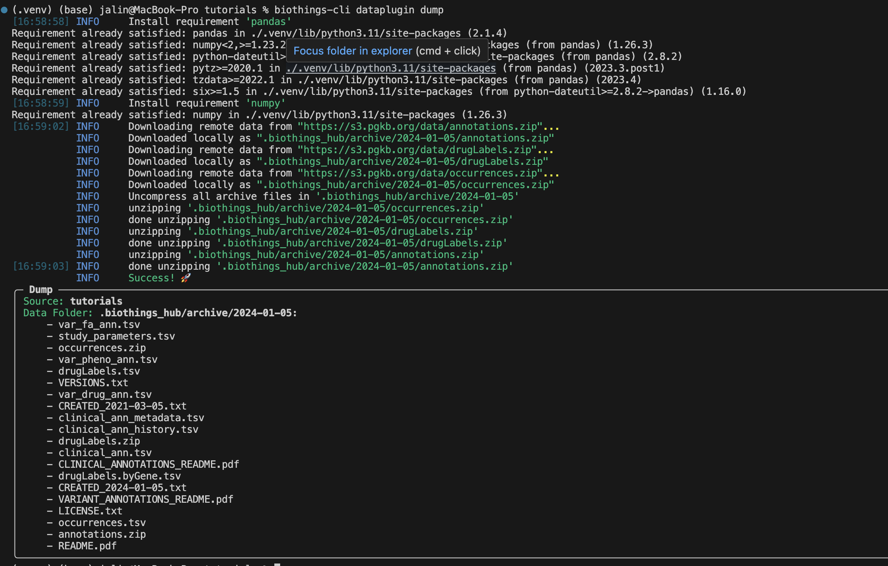
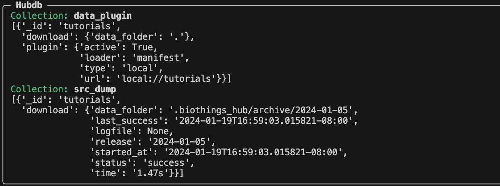
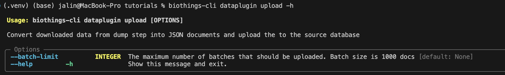
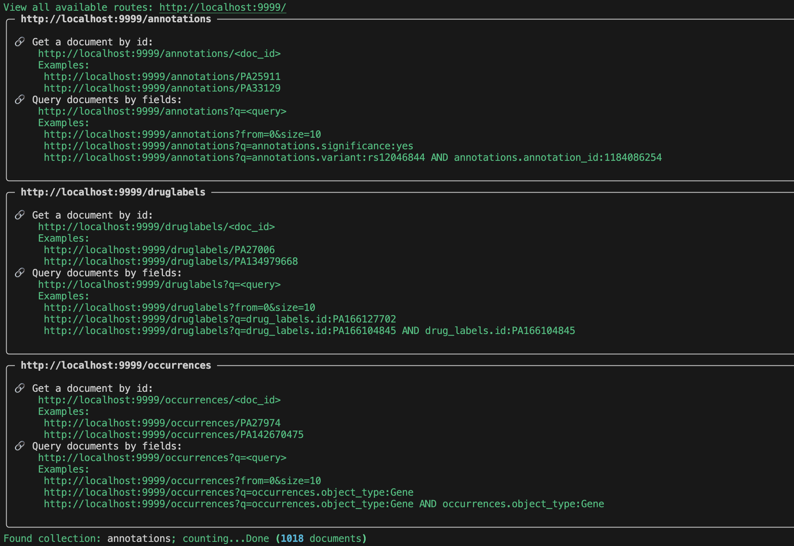
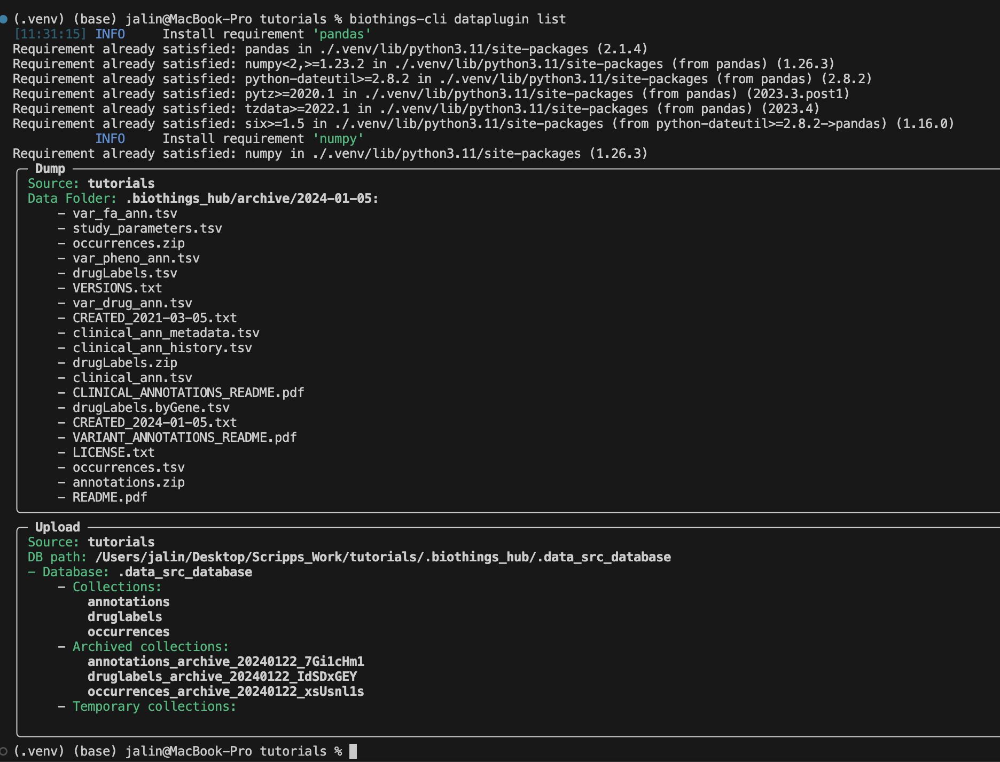
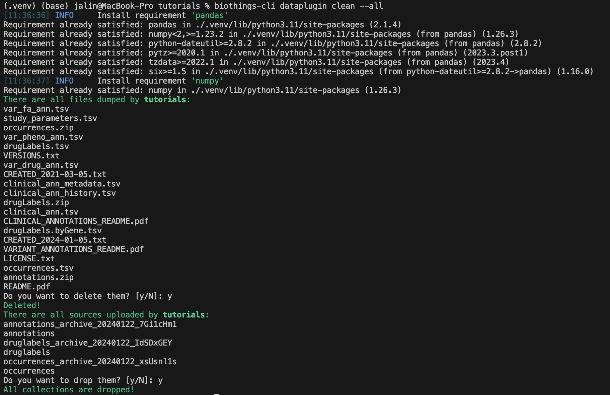
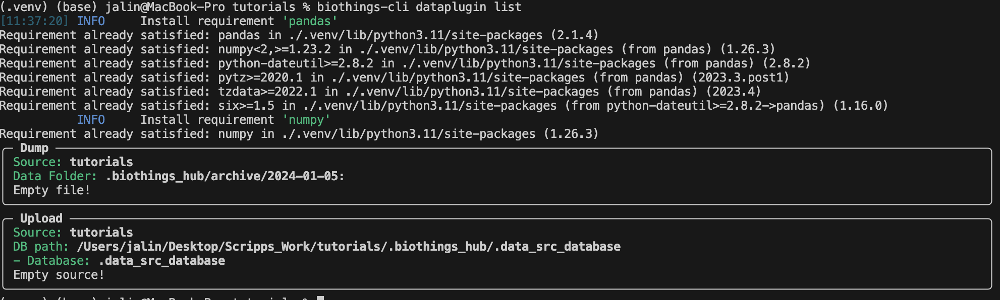

*************
BioThings CLI
*************

Introduction
============

The BioThings CLI (Command Line Interface) provides a set of conveniance command
line tools for developers to create and test data plugins locally. Compared to the
option of setting up a local Hub running in docker containers, the CLI further lowers the
entry barrier by NOT requiring docker or any external databases installed locally.
It is particularly suitable for data plugin developers to build and test their data plugin
independantly. When a data plugin is ready, they can then pass the data plugin to a running
BioThings Hub to build the data plugin into a BioThings API.

This tutorial aims to provide a comprehensive guide to the BioThings CLI,
covering its essential commands and functionalities. We will explore a range of
topics including installation, initial setup, and core features such as data
plugin management, data plugin hub management, and utility commands.
Additionally, we will delve into practical applications of the CLI, demonstrating
how to work with the API server for data access and manipulation.

=============
Prerequisites
=============

To use the BioThings CLI, you need to have Python installed on your system, specifically version 3.7 or higher.

Ensure that your Python version meets this requirement by running:

.. code-block:: bash

    python --version

If you need to install or upgrade Python, visit the official Python website at https://www.python.org/downloads/ for the latest version.

In addition to Python 3.8 or higher, having Git installed on your system is essential for using the BioThings CLI, particularly if you need to clone repositories or manage version-controlled code.

To check if Git is installed on your system, run:

.. code-block:: bash

    git --version

If Git is not installed, you can download and install it from the official Git website:

- For Windows and macOS: Visit [Git's official download page](https://git-scm.com/downloads).
- For Linux: Use your distribution's package manager (e.g., `apt-get install git` for Ubuntu, `yum install git` for Fedora).

After installing Git, you can proceed with the setup and usage of the BioThings CLI.

===========
Setting Up
==========
Clone the tutorials repository on our Biothings group.

.. code:: bash

   git clone https://github.com/biothings/tutorials.git
   cd tutorials
   git checkout pharmgkb_v5

Now we will need to install the requirements to run our Biothings CLI. We will first create a virtual environment and then install a Biothings Hub CLI environment.

.. code:: bash

   python -m venv .venv
   source ./.venv/bin/activate
   pip install "biothings[cli]"

======================================
Create and Test the dataplugin via CLI
======================================

Lets check out our command line inputs. Here is a quick summary of every command we will be using in this tutorial.

* biothings-cli dataplugin dump: Download source data files to local
* biothings-cli dataplugin list: Listing dumped files or uploaded sources
* biothings-cli dataplugin upload: Convert downloaded data from dump step into JSON documents and upload the to the source database
* biothings-cli dataplugin serve: *serve* command runs a simple API server for serving documents from the source database.
* biothings-cli dataplugin clean: Delete all dumped files and drop uploaded sources tables

If you have any futher questions on what other options are available in our biothings-cli. You can check out more using the ``--help`` or ``-h`` flag on any attribute. Examples:

* ``biothings-cli --help``
* ``biothings-cli dataplugin --help``
* ``biothings-cli dataplugin dump -h``

The Biothings CLI can only be used for a manifest based plugin. Looking at our manifest file, we are using a JSON based manifest with multiple uploaders.
Check out our `manifest section <studio.html#manifest-plugins>`_ to know more about the different types of manifest files that can be used with our Hub.

.. code:: bash

    {
        "version": "0.3",
        "requires" : ["pandas", "numpy"],
        "dumper" : {
            "data_url" : ["https://s3.pgkb.org/data/annotations.zip",
                        "https://s3.pgkb.org/data/drugLabels.zip",
                        "https://s3.pgkb.org/data/occurrences.zip"],
            "uncompress" : true
        },
        "uploaders" : [
            {
                "name" : "annotations",
                "parser" : "parser:load_annotations",
                "mapping" : "parser:custom_annotations_mapping",
                "on_duplicates" : "error"
            },
            {
                "name" : "druglabels",
                "parser" : "parser:load_druglabels",
                "on_duplicates" : "error"
            },
            {
                "name" : "occurrences",
                "parser" : "parser:load_occurrences",
                "on_duplicates" : "error"
            }
        ]
    }

* `version` specifies the manifest version (it's not the version of the datasource itself) and tells the Hub what to expect from the manifest.
* parser uses ``pandas`` and ``numpy`` library, we declare that dependency in `requires` section.
* the `dumper` section declares where the input files are, using `data_url` key. In the end, we'll use 3 different files so a list of URLs is specified there. A single
  string is also allowed if only one file (ie. one URL) is required. Since the input file is a ZIP file, we first need to uncompress the archive, using `uncompress : true`.
  We will see the uncompressed contents shortly after dumping.
* the `uploaders` section tells the **Hub** how to upload JSON documents to MongoDB. `parser` has a special format, `module_name:function_name`. For example the first parsing function is named
  `load_annotations` and can be found in `parser.py` module. `'on_duplicates' : 'error'` tells the **Hub** to raise an error if we have documents with the same _id (it would
  mean we have a bug in our parser).

Now we we will run the dump process using the CLI `dump` command.

.. code:: bash

    biothings-cli dataplugin dump

There should be a successful dump along with the dump contents in the ``.biothings_hub/archive/DATE_TIME`` directory.

.. note::
    Remember since we set uncompress as ``true`` in the manifest the ``.biothings_hub/archive/DATE_TIME`` will contain both the zip files
    and the uncompressed contents.

In our ``.biothings_hub`` directory, there should be a sqlite database that was created called biothings_hubdb.
Lets take a look at it's contents using ``biothings-cli dataplugin list --hubdb``.

We can see two collections that have been created during our dump.

The ``data_plugin`` collection contains the information of our ``tutorial`` dataplugin.
The each entry within the ``data_plugin`` contains:

* _id: name of the plugin
* download.data_folder: where the plugin is located
* plugin.active: if the plugin is still being used
* plugin.loader: type of plugin, at the moment, we can only using manifest type plugins for the cli, but more features will be updated in the future to include other types
* plugin.type: local vs remote repository
* plugin.url: plugin source folder

The ``src_dump`` collection contains the information of our dumps:

* _id: name of the dataplugin
* download.data_folder: location of the dumped contents
* download.last_success: datetime of last successful dump
* download.logfile: location of generated logfiles
* download.release: name of release
* download.started_at: datetime of when the dump was started
* download.status: status of the dump
* download.time: how long the dump process took

Now that our dumper has been populated, we can continue to the upload process. Lets take a look at the upload command.

Since our data is small, we do not need to use the ``--batch-limit`` tag for testing. Instead we can directly run ``biothings-cli dataplugin upload``.

.. image:: ../_static/cliupload.png
    :width: 100%

After a successful upload, the sqlite database ``.biothings_hub/.data_src_database`` is created with three different collections.
Each collection matches the corresponding uploader in our manifest file: `annotations, druglabels, occurences`.

To view our data, we will need to use the ``serve`` command.

.. code:: bash

    biothings-cli dataplugin serve

Once we have served the data, there should be 3 endpoints that are created. Go to http://localhost:9999/ to view all of the available endpoints.
For each endpoint we can query by id:

* http://localhost:9999/annotations/DOC_ID

or field:

* http://localhost:9999/annotations?q=QUERY

Try out a few of the examples for youself listed in the serve output!

.. note::
    You may have noticed that we are able to serve `occurences` and `druglabels` without registering a mapping.
    The reason is because Biothings CLI does not check for correct mappings. If you want to know if your mapping is
    correctly registered, you will have to use our  `biothings studio <studio.html>`_.

To review we can use the ``biothings dataplugin list`` command. Using this command we can see all of our dump and upload information.

Once we are finished with our plugin we can delete our unused data with ``biothings dataplugin clean --all``.
This will delete all the dumped files and drop all the uploaded source data.

We can check if all the data is deleted using ``biothings dataplugin list``.

We have successfully set up a Biothings CLI environment and created an API from a flat file using only the CLI.

* by defining a data plugin, we told the **BioThings CLI** where the remote data was and what the parser function was
* We used the **BioThings CLI** to create a new dataplugin and dump the data locally
* We also generated an `uploader` to run the parser and store resulting JSON documents into a SQLite database
* We served the resulting data with a simple API server from the source database.
